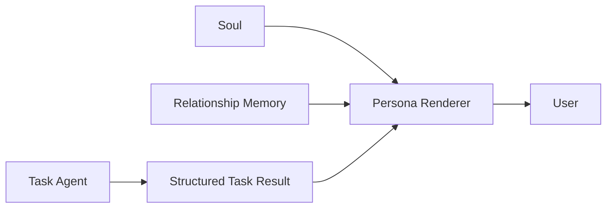

# ADR-012：将 Agent Soul 与任务推理、Relationship Memory 解耦

- Status: Accepted
- Date: 2026-10-06
- Decision scope: Agent personality, long-term relationship memory, final answer rendering

## Context

项目中的 Agent 同时承担任务执行和长期交互角色。人格信息和长期关系记忆可能影响模型的任务推理，即使它们与当前任务无关。因此，把 Soul 或 Relationship Memory 直接放进 Task Agent 的 reasoning context，会扩大干扰面并降低任务边界的可解释性。

另一方面，长期运行的本机 Agent 又需要保持稳定的身份、表达风格和跨任务连续感。这个需求与任务完成能力不同，应在任务结果形成后处理。

因此明确区分：

1. Task Agent：负责任务事实、证据、工具、推理和结论。
2. Soul：负责稳定身份和表达风格。
3. Relationship Memory：负责用户明确表达过的长期交互偏好和关系上下文。
4. Persona Renderer：在任务结果形成后，把结果转换成符合 Soul 和相关 Relationship Memory 的表达。

## Decision

采用以下架构边界：

### 1. Soul 不进入 Task Agent reasoning

Task Agent 不读取 Soul。

Soul 不参与 Mission 判断、Evidence 分析、Claim / Finding、工具选择、调查深度、Workflow、停止条件、任务结论、权限和安全决策。

Soul 只定义稳定的身份、称呼、语气、表达节奏、亲近程度和表达习惯。

> **Soul stable, relationship grows.**
>
> **人格不变，关系变熟。**

### 2. Soul 通过 Persona Renderer 影响最终表达

Task Agent 首先独立完成任务并形成最终答案，随后由独立 Renderer 进行表达层转换。

Renderer contract：

- 可以改变措辞、语气、称呼和表达节奏；
- 不得新增、删除或修改事实；
- 不得修改数字、结论或不确定性；
- 不得修改建议或用户需要执行的动作；
- 不得引入 Task Agent 没有提供的新知识；
- 不得因为人格而强化、弱化或重新解释任务判断。

Renderer 失败时直接返回原始 Task Agent answer。

### 3. Relationship Memory 与 Soul 分离

Soul 是稳定配置；Relationship Memory 是动态状态。

Relationship Memory 不用于任务推理，也不作为技术事实、Evidence 或 Research Knowledge。

它只能影响最终表达中的长期表达偏好、称呼、工作交流习惯、用户明确要求保持的长期上下文和长期相处的连续感。

### 4. 第一版 Relationship Memory 采用 explicit-only

只有用户明确表达长期要求时才自动写入 Memory，例如“记住”“以后不要”“以后回答尽量”等。

普通对话、一次行为或模型推断不能直接产生长期 Memory。

Memory 支持 active / superseded 生命周期；新的明确要求可以取代旧要求，但不直接删除历史。

原因是避免“模型推断 → 写入 Memory → 下一次把 Memory 当成事实 → 再次强化错误推断”的自我强化反馈回路。

### 5. Relationship Memory 使用独立存储

当前 Memory 存储于 .data/relationship-memory.json，实现位于 src/relationship/memory.ts。

当前不引入 SQLite、Vector DB、Embedding 或复杂 Memory Graph。规模增长到足以证明 semantic retrieval 必要时，再单独设计演进方案。

## Consequences

- Task Agent 的任务推理与人格解耦；
- Soul 可以长期调整而不改变任务 reasoning prompt；
- Persona Renderer 可以独立迭代；
- Renderer 失败可以安全 fallback；
- Relationship Memory 可以跨 Investigation 保留；
- 小规模长期记忆不需要额外数据库基础设施。

## Alternatives Considered

### A. 将 Soul 直接放进 Task Agent system prompt

**Rejected.** 人格可能影响任务推理、工具选择和结论形成。

### B. Soul 与 Relationship Memory 全部放进 Task Agent

**Rejected.** 长期信息可能与当前任务无关或冲突，会扩大 reasoning context 的干扰面。

### C. 让 Soul 自动持续演化

**Rejected.** 会把稳定人格、用户偏好和模型推断混在一起，导致人格漂移且难以解释。

### D. 第一版直接使用 Vector DB / Embedding Memory

**Rejected for now.** 当前规模不足以证明复杂基础设施的必要性。

## Validation / Acceptance Criteria

1. Task Agent prompt 不包含 Soul。
2. Task Agent prompt 不包含 Relationship Memory。
3. Persona Renderer 不得改变 Task Result 的事实、结论、不确定性和建议。
4. Renderer 失败时返回原始 Task Result。
5. 明确的长期用户偏好可以跨 Investigation 保存。
6. 新 Memory 可以 supersede 旧 Memory。
7. 普通对话不会自动生成长期 Memory。
8. 引入 Soul / Relationship Memory 后，Task correctness、Evidence grounding、Task completion 和 uncertainty calibration 不得出现可接受范围之外的回归。

对应实现和测试见：

- src/agent/prompts.ts
- src/workflow/ask.ts
- src/relationship/memory.ts
- tests/prompts.test.ts
- tests/relationship-memory.test.ts

## Related

- ADR-002：任务事实与 Evidence 的可信边界
- ADR-004：应用状态与长期状态的存储边界
