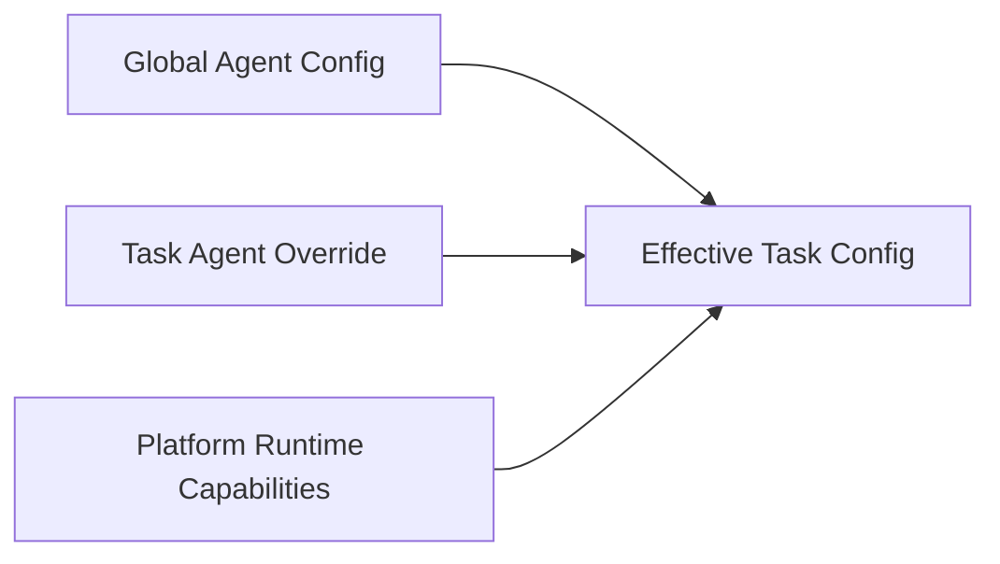

# ADR-013：Global Config 与 Task Override 分层

- Status: Accepted
- Date: 2026-10-06
- Decision scope: Global agent configuration, Investigation-level overrides, runtime capabilities

## Context

Agent 的模型、provider、persona 等设置既存在跨 Investigation 的默认值，也存在某个 Investigation 的任务级调整。

如果把两类配置混在同一个 control.json 中，会让“任务局部修改”意外变成全局修改；反过来，如果任务保存完整配置，又会丢失 Global 默认值的继承关系。

同时，部分字段代表当前应用/runtime 的能力边界，不应该被 Investigation 覆盖。

## Decision

采用两层配置：



### 1. Global Config

Global Config 独立于任何 Investigation 保存。

它定义跨 Investigation 的默认 Agent 行为和用户长期配置。

### 2. Task Override

Investigation 只保存用户或任务明确覆盖 Global 的字段，即 sparse override，而不是完整配置快照。

Effective Task Config 按以下原则计算：

```
Effective = Global defaults + Task explicit overrides + runtime-owned capabilities
```

Task Override 中未出现的字段必须继续继承 Global。

### 3. Task 不能写 Global

Investigation 的保存动作只能修改当前 Task Override / Investigation state。

修改 Global 必须通过 Global Config 的独立入口完成。

Global version 与 Task version 独立；Task 可以记录它所看到的 globalVersion，用于审计和诊断，但不能通过 Task state 修改 Global。

### 4. Runtime capabilities 不属于 Task Config

platformCapabilities 等 runtime/application controlled 能力由宿主应用决定，不允许通过 Task Override 绕过。

它们不是用户任务配置，也不是模型可以自行修改的字段。

### 5. Sparse schema 必须真正保持 sparse

Task Override schema 不得因为字段上的 default 而在 parse 时补出隐式值。

不能简单把一个带 defaults 的 schema 做普通 partial()；override schema 应移除 default，再使每个字段 optional。

当前实现只支持 v2 sparse override；旧版完整 Task Config 不再作为运行时兼容格式恢复或迁移。

## Consequences

- Global 与 Investigation 的职责边界清晰；
- 修改某个任务不会污染其它 Investigation；
- Global 默认值可以自然继承到已有任务；
- 配置来源和版本可以审计；
- runtime capability 不会被用户配置误修改。

代价是读取时需要计算 Effective Config，并维护旧配置格式的迁移逻辑。

## Rejected Alternatives

### A. 所有配置都存在每个 Investigation

**Rejected.** 无法表达可靠的 Global default，也容易产生跨任务配置漂移。

### B. Task 直接修改 Global

**Rejected.** 会破坏 Investigation isolation，使局部操作产生不可预期的全局副作用。

### C. Task 保存完整 Effective Config

**Rejected.** 会把继承关系冻结成快照，Global 修改后已有任务无法清晰表达真正的 override。

## Related

- ADR-003：本机单用户 Agent runtime
- ADR-009：UI 负责编辑，不拥有后端 Investigation 状态
