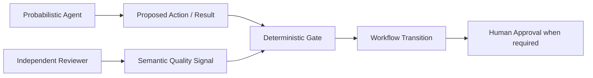

# ADR-014：概率 Agent 与确定性 Gate 的控制边界

- Status: Accepted
- Date: 2026-10-06
- Decision scope: Agent actions, semantic checks, workflow transitions, approval boundaries

## Context

Agent 是概率模型，适合提出调查动作、解释证据、判断语义匹配和生成工作成果，但不能因为模型认为“已经完成”就直接改变系统的关键状态。

项目已经同时存在 Mission Gate、Scope Validation、Evidence Gate、Independent Reviewer 和人工批准。需要统一原则，避免某一个 LLM 判定覆盖另一个确定性边界。

## Decision

系统采用“概率 Agent 提议 + 确定性 Gate 约束状态”的控制模型：

### 1. Agent 负责建议，不直接拥有关键状态转换权

Agent 可以：

- 选择调查动作；
- 提出假设和候选；
- 解释 Evidence；
- 生成报告、Target、Mapping 等成果；
- 提出“应该进入下一阶段”的判断。

Agent 的自然语言 success、completion 或 self-review 不能单独推进 Workflow。

### 2. Deterministic Gate 是关键状态转换的权威条件

对于可以确定性验证的条件，由 Script / Code Gate 判断。

例如：

- Mission 是否完整且已确认；
- Scope 是否已经验证；
- Evidence 是否存在且 provenance 完整；
- artifact schema 是否合法；
- Workflow state 是否允许转换。

只有 Gate 通过后，服务端才允许对应 Workflow transition。

### 3. Smart Function 是 advisory semantic signal

Smart Function / semantic judge 可以帮助判断“当前动作与 Mission 是否匹配”“某成果是否回答目标”等语义问题。

它是辅助信号，不取代可以确定性判断的 Gate。只有明确声明为可降级的非阻断提示，semantic signal 才可以缺失；一旦某个 Gate 把该 signal 作为必要检查项，signal unavailable 必须 fail-closed，不能自动解释为通过。

Smart Function 失败不能自动等价为 Gate 通过。

### 4. Independent Reviewer 是独立质量检查，不是 Evidence Gate

Reviewer 用于检查可读性、目标匹配、内部一致性和决策价值。

Reviewer 不能补证据，也不能把未经验证的内容提升为事实。

Reviewer 通过也不能绕过 Evidence Gate 或人工批准。

### 5. Human 是最终业务批准边界

涉及 cutover、业务权威、重要例外和其它不可逆业务决定时，最终批准权属于 Human。

Agent、Smart Function、Reviewer 都不能替代人工批准。

### 6. Gate 必须发生在 Workflow transition 之前

状态机只能从一个已经满足前置条件的状态进入下一个状态。

因此“Agent 说完成”与“系统承认完成”是两个不同事件。

## Consequences

- 关键状态转换可审计、可复现；
- Agent 可以保持较高自主性而不直接掌握系统控制权；
- Reviewer、Smart Function、Evidence Gate 的职责不会互相覆盖；
- 错误的模型判断不会直接绕过确定性边界。

代价是每个需要推进的阶段必须定义可以机器验证的 gate condition，并保存失败原因。

## Rejected Alternatives

### A. Agent 自己决定什么时候完成

**Rejected.** 概率判断不能成为不可逆状态迁移的唯一依据。

### B. Reviewer 通过即可进入下一阶段

**Rejected.** Reviewer 只证明语义质量，不证明 Evidence、业务确认或实际验证。

### C. Gate 失败时自动相信 Smart Function

**Rejected.** advisory signal 不能绕过 authoritative deterministic check。

## Related

- ADR-002：Evidence-first
- ADR-005：Workflow / Skill / Tool / Agent 分工
- ADR-010：Independent Artifact Review
- ADR-011：Mission Contract
- ADR-015：Scope Validation
