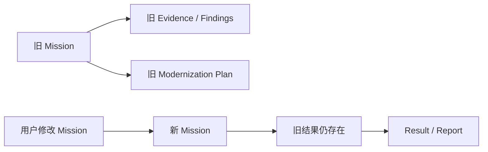
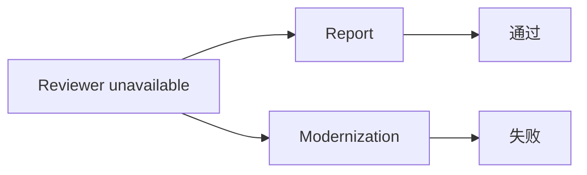
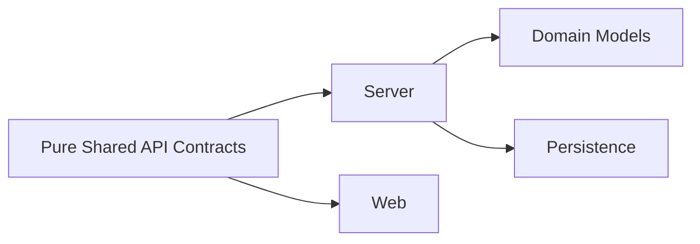
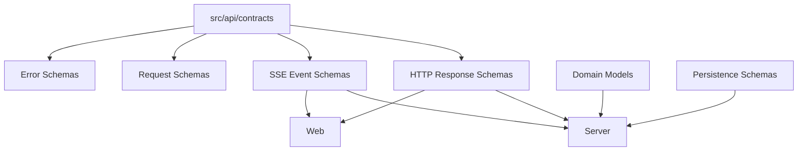

我检查下来，确实还有一批，而且已经能看出一条比较明确的问题模式：

> 现在的问题不主要是“某个字段写错了”，而是系统里存在多组 **隐式 Contract**：后端 Schema、后端运行时 Interface、API JSON、前端 TypeScript Interface、UI 自己的解析规则，各自都在描述同一个状态。

这正是之前“阶段小结为空”这类问题反复出现的根源。

下面按严重程度列出来。**这次我没有继续改代码。**

---

# 一、已经构成实际行为风险的问题

## P0：Mission 改变后，旧的 Result Artifact 仍可能被当成当前结果

这是我认为现在最值得优先处理的一个。

`confirmInvestigationMission()` 在 Mission 变化时只失效：

```text id="2g9p9k"
ScopeValidation
Copilot Session
JourneyPlan
```

但是没有让下面这些成果失效：

```text id="u9j4g3"
Evidence
Claims
Findings
Discovery Snapshot
modernization-plan.json
architecture-assessment.json
```

而：

* `buildReport()` 会直接使用当前 `inv.findings`、`inv.claims` 和最新 snapshot
* `loadModernizationPlan()` 直接读取已有 `modernization-plan.json`
* `loadArchitectureAssessmentPlan()` 直接读取已有 `architecture-assessment.json`

这意味着：



存在出现**新 Mission + 旧调查成果混合**的可能。

更具体地说，Modernization Plan 本身现在虽然有 `goal`、`scope`，但没有与当前 Mission 建立明确的 generation/fingerprint 关系。

### 建议的最终模型

结果 artifact 应该至少带：

```text
missionFingerprint
scopeFingerprint
sourceInvestigationRevision
artifactVersion
```

然后结果读取时明确判断：

```text
current mission/scope
        ↓
artifact belongs to current generation?
        ↓
yes → available
no  → stale
```

这个问题比普通 TypeScript 类型漂移严重得多，因为它可能生成**事实正确但属于另一个任务的错误结果**。

---

# 二、Workflow / Progress 存在多个“事实解释器”

## P0：Assessment Workflow 的 completion condition 实际没有对应事实来源

这里是一个很典型的“定义存在，但实现没接上”。

`journey.ts` 已经定义：

```text id="zq8d1z"
assessment-findings
assessment-recommendation
assessment-roadmap
```

但是 `buildJourneyFacts()` 在 `journey-editor.ts` 中只读取了：

```text id="qz9k99"
modernization
```

没有加载：

```text id="j9m18v"
architecture-assessment.json
```

也没有填：

```text id="6q7d9v"
findingCount
recommendationCount
roadmapItemCount
```

所以：

```text
assessment-findings
assessment-recommendation
assessment-roadmap
```

在真正 Workflow transition 时可能永远拿不到 `true`。

这和前面的 Result 问题是同一种设计错误：

> 有一个 Contract/概念，但是事实来源没有真正接上。

---

## P0：MissionProgress、JourneyFacts、JourneyState 对同一个 Modernization 成果用了不同定义

这个更值得注意，因为现在已经存在**同一份数据、三个解释结果**。

### Target Architecture

`mission-progress.ts`：

```text id="9r9w5u"
components.length > 0
→ covered
```

但是 `buildJourneyFacts()`：

```text id="h8b5zm"
targetArchitecture.status !== 'draft'
&& components.length > 0
```

才算有效。

因此：

```text
targetArchitecture.status = draft
components = 3
```

可能出现：

```text
Mission Progress → 已覆盖
Journey → 未完成
```

---

### Mapping

`mission-progress.ts`：

```text id="j7q1gr"
mappingCount = plan.mappings.length
```

也就是 proposed mapping 就算。

`buildJourneyFacts()`：

```text id="r0k6zr"
mapping.status !== 'rejected'
```

算。

而 `buildModernizationPlan()` / `loadModernizationPlan()` 构造 JourneyState 时：

```text id="m2x3s0"
mapping.status ∈ reviewed / approved
```

才算。

于是同一个 Mapping：

```text
proposed
```

可能得到：

```text MissionProgress → 有 Mapping
JourneyFacts     → 有 Mapping
JourneyState     → 没 Mapping
```

这会直接影响：

* Mission 覆盖率
* Workflow completion
* 工作地图 UI

这是**真正的 domain semantic drift**。

---

# 三、Reviewer 的契约语义不一致

## P1：Report Reviewer 与 Modernization Reviewer 对“审核不可用”的处理不同

`reviewArtifact()` 在 Reviewer 完全无法工作时返回：

```text
status = fail
availability = unavailable
```

但是：

### Report

`runReport()`：

```text
review.status !== pass
&& availability !== unavailable
```

才抛错。

所以：

```text
Reviewer unavailable
→ Report 仍然可发布
```

### Modernization

`runModernizationGate()`：

```text
reviewPassed = review.status === 'pass'
```

所以：

```text
Reviewer unavailable
→ Gate fail
→ Workflow 不能推进
```

即：



这与 ADR-010 的描述也不完全一致。

应该明确一个统一的 policy：

```text
completed + pass
completed + fail
unavailable
```

三种状态到底如何影响 artifact availability / workflow transition。

现在是两个地方各自解释。

---

# 四、Result API 本身还有生命周期问题

## P1：`GET /results` 实际上会执行 LLM + Reviewer + 写文件

现在：

```text
GET /api/sessions/:name/results
```

会调用：

```text
runReport()
```

而 `runReport()` 会：

1. 重新 build report
2. 调 Reviewer
3. 保存 reviewer
4. 覆盖 report.md

所以：

```text
用户按“刷新”
        ↓
GET results
        ↓
重新调用 LLM
        ↓
重新 Reviewer
        ↓
重新写 Report
```

这意味着“读取结果”和“生成结果”混在一起。

而 modernization / assessment 的语义却不同：

```text
GET modernization
→ 读取已有 artifact

GET assessment
→ 读取已有 artifact

GET report
→ 重新生成
```

所以现在三种 Result 的 freshness semantics 不一致。

最终应该明确：

```text
GET  = read
POST /regenerate = generate
```

或者至少让 artifact 有：

```text
generatedAt
sourceRevision
reviewedAt
```

然后 GET 只在 artifact stale 时重新生成。

---

# 五、Report Gate 的 API 错误契约不统一

## P1：业务阻断有时返回 409，有时变成 500

现在：

* Mission Gate → 409
* Scope Gate → 409
* Report Gate 其它失败 → 500
* Reviewer fail → generic Error → 500

例如 Report Gate 没有 Discovery：

```text
assertCurrentStateReportGate()
→ throw Error
→ Express generic error handler
→ HTTP 500
```

但从业务语义上：

```text
500 = server broken
409/422 = 当前状态不允许生成
```

这两个完全不是一回事。

结果页面现在不得不把某些真正的业务阻断当成：

```text
“读取结果失败”
```

而不是：

```text
“结果尚未具备生成条件”
```

建议后面建立统一：

```text
ApiError
├── validation
├── precondition
├── conflict
├── not_found
├── internal
└── ...
```

---

# 六、Journey 有两套 API / 两套状态模型

这是目前系统里第二明显的 Contract 重复。

## P1：`/journey` 和 `/workflow` 描述同一个东西

现在：

```text
GET /api/sessions/:name/journey
GET /api/sessions/:name/workflow
```

两个接口都返回 Workflow 当前状态，但结构不同。

`/journey`：

```text
journey
routePlan
workflow
```

`/workflow`：

```text
WorkflowSnapshot
├── definition
├── layout
├── execution
├── state
└── events
```

而 `/journey` 实际又来自：

```text
getJourneySnapshot()
```

所以这是两个 API projection 在表达同一个 domain state。

ADR-009 说：

> Journey / Workflow execution state 由服务端拥有。

但是现在实际上有两个 presentation contract。

应该最后确定：

```text
WorkflowSnapshot = canonical API resource
```

`/journey` 只保留 compatibility，或者完全统一。

---

# 七、Journey Snapshot 自己内部就重复存了一份 Execution

`JourneySnapshot`：

```text id="9n2d9f"
execution: JourneyExecution
state: JourneyState
```

而 `JourneyState` 本身包含：

```text id="1p6y0v"
execution: JourneyExecution
```

于是：

```text
snapshot.execution
snapshot.state.execution
```

其实是同一个状态。

现在 `getJourneySnapshot()` 明确把两者设置成一样：

```text
state
execution: state.execution
```

但这仍然是两个字段。

以后任何一个调用方都可能拿错。

这和刚才的：

```text
event.id
details.id
```

属于同一种结构性风险。

---

# 八、前端 JourneyState 类型已经明显漂移

`web/src/app/types.ts`：

```text id="shn9fi"
nodeType:
'task' | 'gate' | 'review' | 'end' | 'stop'

unlockedNodeIds

unlocked
```

但 backend `journey.ts`：

```text id="y1d0g6"
nodeType:
'task' | 'review' | 'end'

没有 unlockedNodeIds
```

这里已经出现了非常明显的“旧世界残留”。

目前 `InvestigationContextPanel` 只用了：

```text stages
id/title/objective/status/nodeType
```

所以没有立即炸掉。

但这已经和“阶段小结”的 bug 属于同一类问题了：

> TypeScript 告诉前端一个后端并不存在的 Contract。

---

# 九、Trajectory 页面完全自己维护了一套 Backend Contract

## P1

`AgentTrajectoryPage.tsx` 自己定义：

```text TrajectoryEvent
TrajectorySummary
TrajectoryTurnSummary
ExecutionStatus
ConversationTurnSummary
```

而 backend 已经有：

```text src/investigation/trajectory.ts
TrajectoryEventSchema
TrajectorySummarySchema
TrajectoryTurnSummary
```

现在虽然字段大体还一致，但这是高风险区域。

尤其：

```text backend TrajectoryEvent.details = record<string, unknown>
```

前端所有 event detail 又自己解释：

```text pendingPermissions
requestId
turnUsage
preCompactionTokens
errorType
...
```

没有一个统一 schema。

---

# 十、SSE 是整个系统最松散的 Contract

## P1

Server：

```text
send('started', ...)
send('status', ...)
send('checkpoint', ...)
send('reasoning', ...)
send('delta', ...)
send('companion_note', ...)
send('completed', ...)
send('error', ...)
```

Client：

```text
if (event === 'started') ...
if (event === 'status') ...
if (event === 'checkpoint') ...
...
```

但实际上：

```text
consumeSse()
```

只是：

```text id="1zck1g"
event: string
data: unknown
```

然后整个 Controller 大量使用：

```text
data as { ... }
```

或者：

```text
data as InvestigationCheckpoint
```

没有：

```text
SseEventSchema
```

所以以后：

```text
server 改字段
↓
frontend TypeScript 完全不知道
```

这是目前最容易再次制造“字段层级错了但编译还能过”的地方。

---

# 十一、HTTP Response 基本没有 Runtime Contract

现在 `src/api/schemas.ts` 基本都是：

```text
Request Schema
```

也就是只验证：

```text
POST/PATCH/PUT body
```

但下面这些 response 大部分没有对应 Zod schema：

```text
Session
ExecutionStatus
Permissions
UserInputs
Audit
WorkflowSnapshot
Control
Models
Datasets
Messages
Journey
Trajectory
```

前端大量使用：

```text
await response.json() as SomeType
```

这其实只是 TypeScript assertion，不是 validation。

目前新的：

```text
ResultViewModelSchema
```

反而已经是系统里少数真正完整的：

```text
Server Response Contract
```

应该把这个模式推广，而不是继续增加更多 interface。

---

# 十二、Configuration 存在重复 Contract

目前至少有三份：

```text
src/investigation/schemas.ts
    ControlAgentSchema / InvestigationControlSchema

web/src/app/types.ts
    InvestigationControl

web/src/components/InvestigationConfigPage.tsx
    ConfigPageControl
```

尤其 `ConfigPageControl` 是手写的超长 interface。

它还没有：

```text
platformCapabilities
```

而 backend Control Agent 已经有这个字段。

这次虽然没有立即出 bug，是因为 JS runtime object 实际仍然保留字段，但 TypeScript contract 已经不真实。

---

# 十三、WorkflowId 也有重复定义

现在至少有：

```text
src/investigation/schemas.ts
WorkflowIdSchema

web/src/app/types.ts
WorkflowId

web/src/app/routing.ts
isWorkflowId()

web/src/components/InvestigationConfigPage.tsx
ConfigWorkflow

web/src/components/InvestigationConfigPage.tsx
workflowOptions
```

这几个目前值基本一致：

```text
legacy-modernization
financial-ai-native-architecture
data-architecture-assessment
```

但是所有地方都可以独立改。

尤其 `workflowOptions` 在：

```text
web/src/app/types.ts
web/src/components/InvestigationConfigPage.tsx
```

重复。

---

# 十四、Mission / Progress 也没有真正的 Shared Contract

Backend：

```text
MissionContractSchema
MissionDeliverableSchema
```

但是：

```text
MissionProgress
MissionDeliverableProgress
MissionDeliverableStatus
```

只是 TS interface / union。

Frontend 又重新定义一套：

```text
MissionContract
MissionDraft
MissionProgress
MissionDeliverableProgress
```

目前字段一致，但没有 runtime validation。

而 Progress 又是 Workflow completion 的核心事实之一，所以这里比普通 UI type 更应该有统一 schema。

---

# 十五、SessionData 里还有一个已经变成“重复真源”的 Checkpoints

`GET /api/sessions/:name` 现在仍然返回：

```text id="f2zq28"
checkpoints
```

但新的 Result 页面已经使用：

```text id="a5s7w2"
GET /api/sessions/:name/results
    → checkpoints
```

而 `useInvestigationController` 实际没有使用：

```text current.checkpoints
```

也就是说：

```text Session API
    └── checkpoints

Results API
    └── checkpoints
```

存在两个入口。

这跟之前的：

```text /journey
/workflow
```

是同一种问题。

最终应该明确：

```text Session = workspace/runtime summary
Results = result resource
Trajectory = execution trace
```

三者不要交叉携带同一 domain object。

---

# 十六、Current State 在前端也是“匿名 Projection”

`CurrentStateIntelligence` 后端是完整模型：

```text
coverage
sourceOfTruthCandidates
semanticCandidates
semanticAssets
highValueAssets
```

但 `web/src/app/types.ts` 里的 `SessionData.currentState` 又手工定义了一份：

```text
coverage 的一部分
sourceOfTruthCandidates: unknown[]
semanticCandidates: unknown[]
highValueAssets
```

这个本身可以是合理的 UI Projection。

问题在于现在没有明确叫：

```text
CurrentStateSummary
```

而是直接叫：

```text
currentState
```

很容易让人误以为它就是 backend canonical CurrentState。

这是“projection 没有显式建模”的问题。

---

# 十七、持久化 Snapshot 的 Runtime Schema 不完整

这是 backend 内部比较重要的一项。

`DiscoverySnapshot` 是：

```text
interface DiscoverySnapshot
```

保存：

```text
saveDiscoverySnapshot(...)
```

读取：

```text
loadLatestSnapshot<T>()
```

最后只是：

```ts
JSON.parse(...) as T
```

没有 Zod validation。

也就是说：

```text
context.json
→ 有 WorkspaceContextSchema

modernization-plan.json
→ 有 ModernizationPlanSchema

assessment.json
→ 有 ArchitectureAssessmentPlanSchema

trajectory.jsonl
→ 有 TrajectoryEventSchema

discovery/*.json
→ 没有 Runtime Schema
```

而 Discovery Snapshot 恰恰是大量后续逻辑的事实来源。

这与整个 Evidence-first / deterministic gate 的理念不完全一致。

---

# 十八、Trajectory / Journey Event 对损坏数据会“静默丢弃”

`readTrajectory()`：

```text id="g1w0ae"
JSON.parse / Zod.parse 失败
→ return null
```

然后继续：

```text filter(Boolean)
```

`loadJourneyRunEvents()` 也类似：

```text JSON.parse 失败
→ []
```

所以：

```text trajectory 文件坏了一条
↓
系统不是报数据损坏
↓
而是这条 event 像不存在一样
```

这其实很危险，因为 Trajectory 又是审计/诊断数据。

结果页面之前恰好就是因为“解析失败后静默消失”，造成：

```text 看起来什么都没有
```

所以这个模式应该列为系统级反模式：

> **对可追溯数据不能 silent drop。**

---

# 十九、Artifact Review 本身没有绑定 Artifact Revision

`ArtifactReviewSchema` 目前有：

```text
artifactType
status
score
summary
issues
reviewedAt
```

但没有：

```text artifactVersion
artifactHash
sourceRevision
```

因此：

```text
target architecture v3
    ↓
review

target architecture v4
    ↓
review file overwritten
```

未来看：

```text target-architecture-review.json
```

不知道它对应 v3 还是 v4。

同样：

```text report-review.json
```

没有绑定 report 内容 hash。

对于你现在设计的 Independent Reviewer / Gate，这实际上是审计链不完整。

---

# 二十、新增的 Result Contract 自身还有两个问题

这是这次重构后马上暴露出来的。

### 1. 它已经是正确方向，但有些字段过于宽松

例如：

```text
modernization.status: string
targetArchitecture.status: string
mapping.status: string
validation.status: string
assessment.status: string
assessment.severity: string
```

这些其实已经有 canonical enum：

```text WorkProductStatusSchema
ValidationCheckSchema
FindingSeveritySchema
```

现在 View Model 又退回：

```text z.string()
```

等于在新的边界重新降低了 Contract 强度。

---

### 2. `src/api/results.ts` 的共享边界依赖了 server-only module

现在：

```text
web
 ↓
src/api/results.ts
 ↓
src/investigation/schemas.ts
 ↓
src/evidence/types.ts
 ↓
node:crypto
```

`src/evidence/types.ts` 使用了：

```ts
import { randomBytes } from 'node:crypto';
```

所以现在这个“shared API contract”实际上又拉进了 backend domain module。

这会让：

```text
web
```

和：

```text
server
```

之间的共享边界不够干净。

最终更合理的是：



而不是：

```text
Web → Server Domain → Node-only dependency
```

---

# 最值得优先处理的顺序

我不会建议你把这些全部一次性重构。按照风险，应该分三层。

### 第一层：必须解决

| 问题                                                    |     风险 |
| ----------------------------------------------------- | -----: |
| Mission 改变后旧 Artifact / Findings 仍可能污染新结果             | **P0** |
| Assessment completion facts 没接上                       | **P0** |
| MissionProgress / JourneyFacts / JourneyState 对成果定义不同 | **P0** |
| Reviewer unavailable policy 不统一                       | **P1** |
| Result / Report GET 实际执行生成                            | **P1** |
| API 错误语义 409 / 500 不统一                                | **P1** |

### 第二层：统一 Contract

| 问题                                       | 风险 |
| ---------------------------------------- | -: |
| `/journey` 与 `/workflow` 两套状态 API        | P1 |
| JourneySnapshot 重复 `execution`           | P1 |
| SSE 没有统一 schema                          | P1 |
| Trajectory 前端自己维护 schema                 | P1 |
| 大部分 Response 没有 Runtime Schema           | P1 |
| Session API 和 Results API 都携带 checkpoint | P1 |
| Configuration 多份 interface               | P2 |
| WorkflowId 多份定义                          | P2 |
| MissionProgress 多份定义                     | P2 |

### 第三层：数据完整性

| 问题                                     | 风险 |
| -------------------------------------- | -: |
| DiscoverySnapshot 没有 Runtime Schema    | P1 |
| Trajectory / Journey Event silent drop | P1 |
| Reviewer 没绑定 artifact revision/hash    | P1 |
| Result View Model 使用过宽 `string`        | P2 |
| Shared Contract 依赖 server-only module  | P1 |

---

## 最终应该形成的 Contract 层

我认为现在已经不适合只加一个 `results.ts` 就结束了，应该把这个思路正式扩展成：



其中最重要的原则不是“所有类型都放一个文件”，而是：

> **一个跨边界的数据对象只能有一个 authoritative contract；UI 可以有 Projection，但 Projection 必须明确是 Projection，而不是重新定义 domain object。**

目前最典型的违规对象已经很清楚了：

```text
Checkpoint
Trajectory
Journey / Workflow
Mission
MissionProgress
Control
CurrentState
Session
```

而且它们出现问题的模式高度一致。

**因此我建议下一步不是继续修某一个页面，而是先把这些问题整理成一份“Contract Consolidation Map”，明确每个对象谁是 canonical owner、哪些是 API ViewModel、哪些是 UI Projection、哪些旧接口保留兼容，然后再一次性改。**
