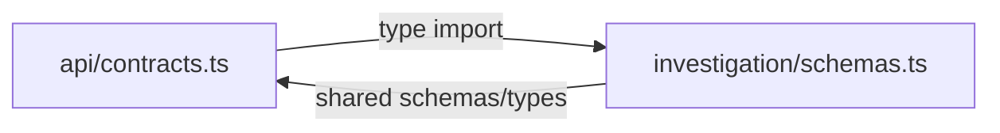
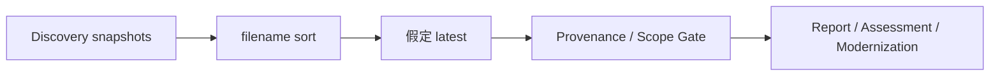
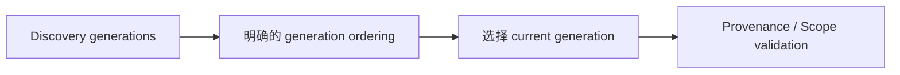

# agentic-data-architect 全库架构一致性审查报告

## 1. 总体结论

当前项目的整体方向是清楚的，而且核心设计其实已经相当完整：

* Mission 是任务边界；
* Scope 是正式前置条件；
* Evidence / DataEstate 是事实基础；
* Workflow 是导航；
* Skill 是能力；
* Stage Gate / Report Gate 是确定性约束；
* Reviewer 负责最终阅读质量；
* Investigation / Conversation / Artifact 分层持久化；
* Copilot / OpenCode 是 Runtime，而不是业务状态拥有者。

问题不在“方向错误”，而在于**几个新加入的设计已经开始与旧实现、旧文档、旧状态模型同时存在**。结果就是同一个概念在不同层面有两三种解释。

我把问题分成：

| 级别 | 含义                          |
| -- | --------------------------- |
| P1 | 会造成真实架构行为错误、错误放行或状态漂移，应优先处理 |
| P2 | 明显设计不一致，会持续制造维护成本或错误理解      |
| P3 | 文档/实现小范围漂移或边缘行为，暂时不阻塞       |

---

# 2. P1：API Contract 与 Domain Schema 出现“双重所有权”

这是我认为目前**最明显的架构边界问题之一**。

`src/api/contracts.ts` 自己定义了一份 `InvestigationControlSchema`，而 `src/investigation/schemas.ts` 又定义了一份同名的 `InvestigationControlSchema`。

更严重的是，两者又发生了反向依赖：

* `api/contracts.ts` type-import `investigation/schemas.ts`
* `investigation/schemas.ts` 又 import `api/contracts.ts`

这实际上形成了：



这和 ADR-016 “Cross-boundary object 应该有唯一 authoritative schema、API contract 独立于 domain” 的目标不一致。

现在最典型的是：

* API 层有 `InvestigationControlSchema`
* Domain 层也有 `InvestigationControlSchema`
* API 层又需要 `GlobalConfigurationSchema`
* Global Config 真实定义仍然在 Domain 层

这会产生非常实际的问题：

> 到底哪一份 Schema 是“真的”？

今天两边还比较接近，半年以后非常容易出现：

```text
server parse 用 A
web parse 用 A
filesystem 用 B
```

最后不是类型错误，而是**运行时语义漂移**。

[src/api/contracts.ts](https://github.com/saga/agentic-data-architect/blob/main/src/api/contracts.ts?utm_source=chatgpt.com)
[src/investigation/schemas.ts](https://github.com/saga/agentic-data-architect/blob/main/src/investigation/schemas.ts?utm_source=chatgpt.com)
[ADR-016 API Contract Ownership](https://github.com/saga/agentic-data-architect/blob/main/ADR/016-api-contract-ownership-and-view-models.md?utm_source=chatgpt.com)

### 判断

**P1 / 架构级。**

不是现在马上出 bug，而是已经破坏了项目自己定义的 Contract Ownership 原则。

---

# 3. P1：Discovery Snapshot 的“latest”实现和 Generation/Provenance 设计实际上不一致

这是一个更危险的实际逻辑问题。

`src/investigation/store.ts` 的：

```ts
loadLatestDiscoverySnapshot()
```

当前做法是：

```text
读取 discovery/*.json
→ 按 filename 排序
→ 取最后一个
```

但 Snapshot 文件名实际上是：

```text
<runId>.json
```

而 `runId` 并不是一个“时间排序 key”。

因此：

> **“最后一个文件”并不等于“最新一次 Discovery”。**

这会直接影响：

* Report Gate
* Artifact Provenance
* Scope Validation
* Current-State
* Assessment
* Modernization
* Question Context

因为这些地方大量依赖：

```ts
loadLatestSnapshot()
```

项目刚刚又专门建立了：

* generation
* scopeFingerprint
* sourceRevision
* artifact provenance

理论上是在解决“旧 Snapshot 不应该冒充当前状态”。

但如果 Snapshot selection 本身可能拿到一个任意的旧 run，那么后面的 Provenance 判断再正确也没有意义。

也就是说现在的风险是：



正确的方向应该是：



这属于**状态选择错误**，比普通文档问题严重得多。

[src/investigation/store.ts](https://github.com/saga/agentic-data-architect/blob/main/src/investigation/store.ts?utm_source=chatgpt.com)
[src/investigation/artifact-provenance.ts](https://github.com/saga/agentic-data-architect/blob/main/src/investigation/artifact-provenance.ts?utm_source=chatgpt.com)
[ADR-015 Scope Validation](https://github.com/saga/agentic-data-architect/blob/main/ADR/015-scope-validation-precondition.md?utm_source=chatgpt.com)
[ADR-017 Artifact Lifecycle / Provenance](https://github.com/saga/agentic-data-architect/blob/main/ADR/017-investigation-artifact-lifecycle-and-revision.md?utm_source=chatgpt.com)

### 判断

**P1 / 真正的状态语义问题。**

这是我认为目前最值得优先修的代码问题之一。

---

# 4. P1：Workflow 的“确定性 Gate”只在部分 Workflow 真正成立

这是当前设计里第二个比较大的分歧。

Current Data Architecture / Assessment 的 Markdown 都定义了明确的 `completeWhen`：

* `scope-ready`
* `current-data-architecture`
* `assessment-current-state`
* `assessment-findings`
* `assessment-recommendation`
* `assessment-roadmap`

Legacy Modernization 也有明确的阶段完成条件。

但是 `financial-ai-native-architecture` 很不一样：

```text
requirements
data
domain-model
architecture
semantic
agent
controls
evaluation
roadmap
```

这些阶段实际上没有对应的 deterministic `completeWhen`。

Workflow 运行时就可能退化成：

```text
Agent 返回 workflow.outcome
        ↓
applyAgentWorkflowTransition()
        ↓
进入下一阶段
```

也就是说，这条 Workflow 的大量阶段实际上是：

> **Agent 自己说“success” → Workflow 前进**

而 ADR-014 / Skill Contract 明确要求的是：

> Agent 的完成声明不能直接成为关键状态转换的依据。

这不是理论问题。

例如：

```text
金融 AI 架构
→ Agent 自己说 data 阶段完成
→ 进入 domain-model
```

这里到底检查了什么？

代码里没有与其它 Workflow 同等级别的明确 deterministic condition。

所以当前实际上存在两种 Workflow：

### A 类

```text
Agent
  ↓
真实状态
  ↓
Deterministic Gate
  ↓
Workflow transition
```

### B 类

```text
Agent
  ↓
workflow.success
  ↓
Workflow transition
```

而文档把它们都描述为“相同的 Workflow / Gate 模型”。
