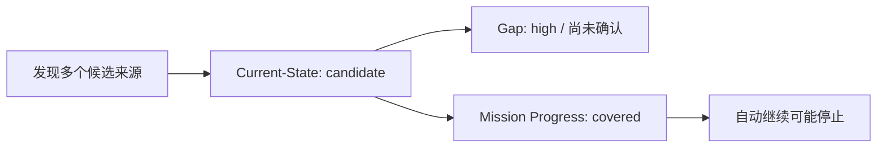
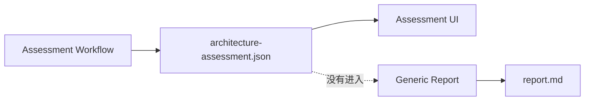
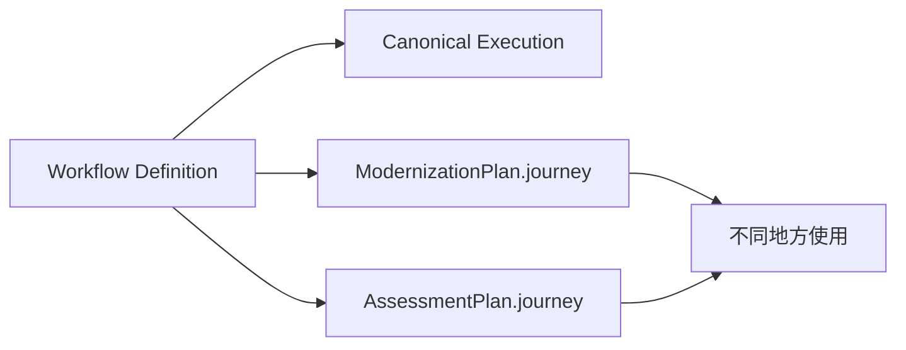
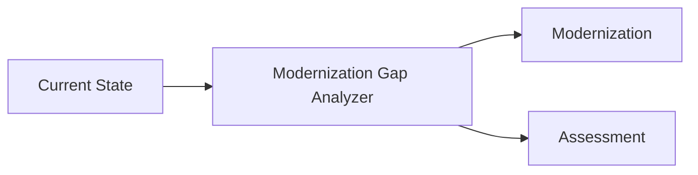
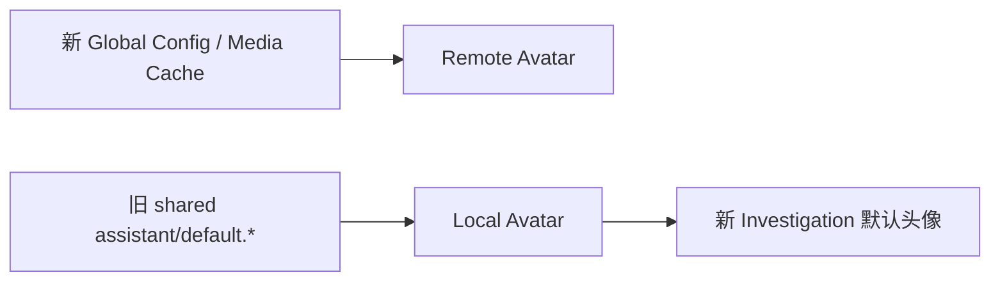
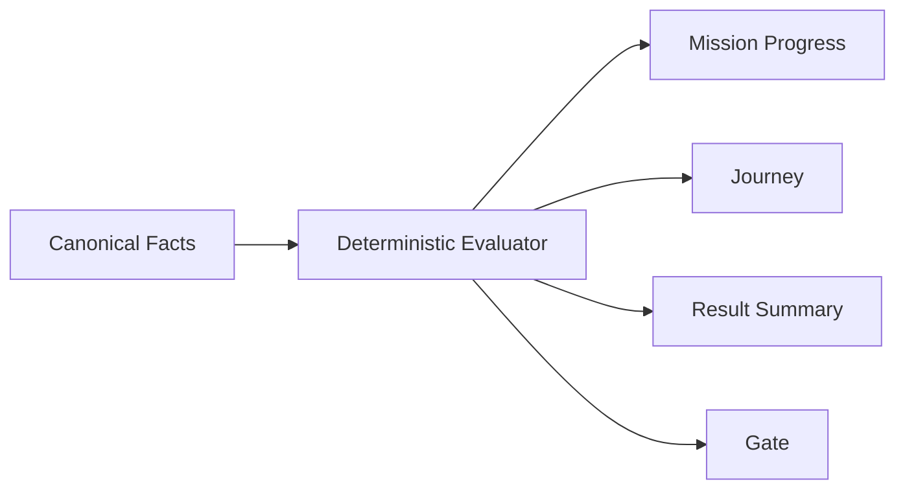
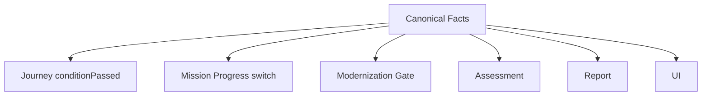
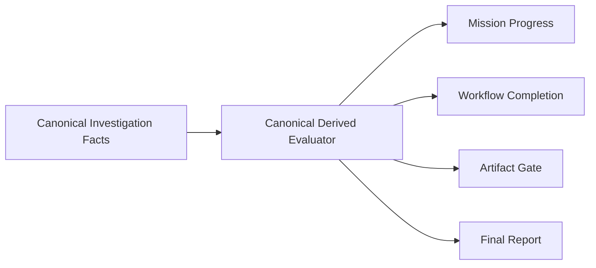

我检查的是当前 `main` 上的代码、ADR、核心设计文档、Workflow Skill、API Contract、测试以及主要前后端运行链路。**本次没有修改任何代码。**

先给结论：

> **目前项目最大的风险不是“代码乱”，而是有几处核心语义已经出现分叉：Mission Progress、Workflow completion、Assessment、Report、Workflow Runtime 这几块没有完全共享同一套事实语义。**
>
> 其中有 **4 个我认为应该优先处理的 P0/P1 问题**，否则系统会出现“一个地方认为完成了，另一个地方认为没完成”以及“产物已经生成，但最终结果没有包含它”的实际错误。

---

# 一、最重要的问题

| 优先级       | 问题                                                                 | 类型                  | 判断        |
| --------- | ------------------------------------------------------------------ | ------------------- | --------- |
| **P0**    | `data-source` 有 Source-of-Truth candidate 就被 Mission 判定为 `covered` | 业务语义错误              | **必须修**   |
| **P0**    | Assessment 没进入统一最终报告，且可能混入 Modernization 结果                        | 功能/架构分歧             | **必须修**   |
| **P0/P1** | Workflow Runtime 出现多个 Journey State                                | 架构违反 ADR-018        | **必须收掉**  |
| **P1**    | `completeWhen` 实际语义明显弱于 Skill / ADR 描述                             | Gate 语义漂移           | **必须修**   |
| **P1**    | Assessment 实现越来越像 Modernization，而 ADR-022 明确要求分开                   | 设计分歧                | **应该重理**  |
| **P1**    | `getJson<T>()` 仍允许跳过 Zod runtime validation                        | Contract 违反 ADR-016 | **必须修**   |
| **P1**    | Assessment 的“0 个 Finding”无法完成，但 Roadmap 又无条件生成                     | Assessment 逻辑错误     | **必须修**   |
| **P1**    | 新 Global Config / Media Cache 与旧 shared avatar 机制并存                | 功能双轨                | **应该统一**  |
| **P1**    | `HOST != 127.0.0.1` + 默认 `allow_all` 存在危险部署组合                      | 安全边界                | **应该加防护** |

下面展开。

---

# 二、P0：Mission Progress 和事实语义已经冲突

这是我认为当前最严重的逻辑问题。

`src/workflow/mission-progress.ts`：

```ts
case 'data-source': {
  const hasAssets = datasets > 0;
  const sourceCandidate = signals.sourceOfTruthCount > 0;

  return covered(
    item,
    sourceCandidate ? 'covered' : hasAssets ? 'in_progress' : 'not_started',
    ...
  );
}
```

也就是说：

> 只要发现了多个可能的 Source-of-Truth，就把 `data-source` 判为 `covered`。

但是 `src/analysis/current-state.ts` 明确规定：

> Source-of-Truth candidate 只是候选，不代表业务权威已经确认。

`src/analysis/gap.ts` 甚至明确产生：

> “Source-of-Truth 仍是候选，不是确认事实”

并且是 `high` severity。

所以现在实际语义是：



这是直接冲突。

而 `missionHasOpenDeliverables()` 只会继续追踪：

```text
not_started
in_progress
```

因此这个 bug 会真实影响 Agent 是否继续调查。

### 为什么它违反现有架构

这直接违反 ADR-019：

> Mission Progress、Journey Facts、Workflow completion、Result summary、Gate 必须共享同一套 evaluator。

现在已经出现了：

```text
Current-State evaluator：candidate ≠ confirmed

Mission Progress evaluator：candidate = covered
```

这不是 UI 显示问题，而是**系统对“完成”的定义不一致**。

**优先级：P0。**

---

# 三、P0：Assessment 已经有自己的结果，但最终报告没有它

ADR-022 定义：

> Current Data Architecture = 讲清楚现状
> Data Architecture Assessment = 判断怎么样、问题是什么、建议怎么改、先改什么

`src/workflow/assessment.ts` 实际会生成：

```text
reports/architecture-assessment.json
```

内容包括：

```text
findings
recommendations
roadmap
currentState
provenance
```

但是 `src/analysis/report.ts` 只显式处理：

```text
current state
findings
modernization
analysis artifacts
```

它读取的是：

```ts
loadModernizationPlan(...)
```

没有读取：

```text
architecture-assessment.json
```

因此存在一个很现实的情况：

> 用户选择 Data Architecture Assessment，系统确实产生了一份完整 Assessment Artifact，但最终的统一 `reports/report.md` 可能完全没有 Assessment 的 findings / recommendations / roadmap。

这直接违反 ADR-023：

> 每次完整 Investigation 至少形成一份用户可读报告，并且不同 Workflow 可以增加自己的结果部分。

所以现在：



这是明显的功能不完整。

---

# 四、P0/P1：Workflow Runtime 仍然存在多个 Journey State

这个问题和你之前做 Contract Consolidation 时的目标直接冲突。

ADR-018 明确说：

> WorkflowSnapshot 是唯一 canonical Workflow runtime resource。

但现在至少存在三套状态：

### 1. 真正的 Workflow Runtime

```text
journey-execution.json
WorkflowSnapshot
execution
```

### 2. ModernizationPlan 中又保存了一份

`src/model/modernization.ts`：

```ts
journey?: JourneyStateSchema
```

### 3. AssessmentPlan 中也保存

`src/workflow/assessment.ts`：

```ts
journey: z.unknown().optional()
```

而且 `assessment.ts` 会重新：

```ts
buildAssessmentJourneyStateFromPlan(...)
```

也就是说：



问题不只是“多保存一个字段”。

它产生了三个可能的状态来源：

```text
真正执行状态
Artifact 内保存的 journey
读取时重新计算出来的 journey
```

一旦三者在某个边界发生变化，就会出现：

> 地图显示 A，Artifact 认为 B，重新计算又认为 C。

这正是 ADR-018 原来要消除的问题。

尤其 `ArchitectureAssessmentPlan.journey` 还是：

```ts
z.unknown().optional()
```

这说明它甚至没有被纳入完整的 runtime contract。

**这是当前最明显的架构残留之一。**

---

# 五、P1：Workflow `completeWhen` 实际上比 Skill 声明的语义弱很多

这是另外一个很关键的问题。

例如 Legacy Modernization：

`skills/legacy-modernization/SKILL.md` 对 `data-truth` 的描述是：

> 确认数据从哪里来、代表什么、哪个来源最可信，以及数据质量有哪些实际问题。

但 `src/workflow/journey.ts` 实际：

```ts
case 'data-truth':
  return Boolean(
    facts.currentState
    && facts.currentState.datasets > 0
    && facts.currentState.parseFailures === 0
    && !facts.highGapKinds.some(kind =>
      ['discovery'].includes(kind))
  );
```

实际只要求：

```text
datasets > 0
parseFailures = 0
没有 discovery high gap
```

它**没有要求**：

```text
Source-of-Truth 已确认
业务 meaning 已确认
data quality 已确认
```

所以 Skill 说：

> “找到数据真相”

代码实际检查的是：

> “我们有数据集，而且 parser 没问题。”

这已经不是“实现细节不同”，而是**Workflow completion semantics 不一致**。

---

## Current Data Architecture 也是一样

Skill 定义：

> 当前架构说明清楚：Source / Flow / Model / Transformation / business meaning / unknowns。

代码：

```ts
case 'current-data-architecture-ready':
  return Boolean(
    facts.currentState
    && facts.currentState.datasets > 0
    && !facts.highGapKinds.some(kind => ['discovery', 'lineage'].includes(kind))
  );
```

所以可能出现：

```text
Dataset 有
Lineage 基本有
=> current-data-architecture-ready = true
```

即使：

```text
业务含义没弄清楚
Source of Truth 没确认
关键 transformation 没搞清楚
```

也可以通过。

这和你建立 Workflow / Gate 的初衷不一致。

---

# 六、P1：Assessment 和 Modernization 的边界正在重新变模糊

ADR-022 专门解决这个问题：

> Current Data Architecture 和 Data Architecture Assessment 必须区分。

现在代码虽然有两个 Workflow ID，但实现层仍然明显共享 Modernization 语义：

`src/workflow/assessment.ts`：

```ts
buildModernizationGaps(...)
```

而 Assessment Journey 的高风险判断又是：

```ts
buildModernizationGaps(...)
  -> highGapKinds
```

也就是说：



这本身未必错误。

**真正的问题在于 Assessment 不只是复用了“事实”，而是在复用 Modernization-oriented gap semantics。**

更明显的是 Assessment roadmap：

```text
先处理高风险问题
再统一数据和治理基础
最后推进目标架构
```

第三步直接变成：

> 推进目标架构。

这已经开始向 Modernization / Target Architecture 靠近。

而 ADR-022 的 Assessment 定义是：

```text
当前是什么
→ 哪里不好
→ 为什么不好
→ 建议怎么改善
→ 先改什么
```

并不要求它天然进入 Target Architecture。

所以我会把这里定义为：

> **架构方向已经有分歧，但还没有完全变成错误。**

现在最好明确：

```text
Assessment 可以复用 Current-State Facts
Assessment 可以复用 Finding
Assessment 可以复用通用 Gap
Assessment 不应该继承 Modernization-specific semantics
Assessment 不应该天然以 Target Architecture 为默认最终阶段
```

这是应该尽快收口的设计问题。

---

# 七、P1：Assessment 在“没有任何问题”时会卡死

这是一个很实际的 bug。

`src/workflow/journey.ts`：

```ts
case 'assessment-findings':
  return (facts.findingCount ?? 0) > 0;
```

这意味着：

```text
Finding = 0
```

永远不能通过。

可 Data Architecture Assessment 完全可能得到：

> 没有发现重大问题。

这种结果应该是合法结果，而不是“无法完成”。

更奇怪的是，`src/workflow/assessment.ts` 又无条件生成 3 个 roadmap item：

```text
先处理高风险问题
再统一数据和治理基础
最后推进目标架构
```

所以现在形成了一个明显矛盾：

```text
0 Finding
   ↓
assessment-findings 永远无法通过

但

assessment-roadmap
   ↓
无条件生成 3 项
   ↓
roadmap 反而立即有内容
```

这说明 Assessment 现在仍然是“先把结构凑出来”，而不是完全由事实驱动。

**P1。**

---

# 八、P1：`getJson<T>()` 仍然违反 ADR-016

这个非常明确，不需要解释太多。

ADR-016 明确规定：

> Web JSON client 默认路径必须要求 runtime schema。

同时明确：

> 不得保留可信泛型 `getJson<T>` bypass。

现在 `web/src/app/api.ts` 仍有：

```ts
export async function getJson<T>(url: string, init?: RequestInit): Promise<T>;
export async function getJson<T>(
  url: string,
  schema: z.ZodType<T>,
  init?: RequestInit,
): Promise<T>;
```

并且：

```ts
return schema ? schema.parse(data) : data as T;
```

所以架构文档写的是：

```text
JSON -> Zod -> business
```

实际仍然允许：

```text
JSON -> as T -> business
```

这和你之前做 Contract Consolidation 要解决的问题是完全相同的。

而且这不是“以后可能出问题”，它直接让团队可以绕过 Contract。

**P1，而且属于非常明确的 ADR/code drift。**

---

# 九、P1：新的 Global Media Cache 与旧 shared avatar 机制是两个设计

这一点比较隐蔽。

现在新设计已经有：

```text
Global Config
.data/global-config.json

Global Cache
.data/cache/media/
```

而头像的新远程媒体路径也是：

```text
resolve
→ actual remote URL
→ Global Cache
→ remote first
→ cache fallback
```

这是一个合理的模型。

但是系统仍然保留：

```text
.workspace/shared/assistant/default.json
.workspace/shared/assistant/default.*
```

而且 avatar upload 仍然会把头像写到这里。

新 Session 创建时，又会继承这个 shared default。

所以事实上存在：



这意味着“Global Avatar”到底属于：

```text
Global Config + Global Media Cache
```

还是：

```text
.workspace/shared/assistant
```

现在没有唯一答案。

更麻烦的是你上一轮已经明确规定：

> Task Config promotion 到 Global 时不能把 task-local avatar path 写进 Global。

但旧 upload endpoint 本身又会产生 shared/global side effect。

所以现在的行为模型实际上是：

> **代码逻辑想做新的 Global boundary，但旧头像机制仍拥有一部分 Global 权力。**

这是典型的架构双轨。

---

# 十、P1：本机 Agent 的安全边界有一个危险组合

默认配置本身没问题：

```text
HOST=127.0.0.1
permissionMode=allow_all
```

对于个人本机 Agent，这是合理的。

问题是：

```ts
HOST
```

可以被设置成：

```text
0.0.0.0
```

而代码没有任何启动保护。

同时 Agent 默认：

```text
allow_all
```

又意味着 shell / file / tool 等操作默认不需要逐项确认。

所以如果用户把：

```text
HOST=0.0.0.0
```

暴露到局域网，而没有额外 Reverse Proxy/Auth，那么实际上是：

> 网络可访问的个人 Agent + 高权限工具执行。

这不代表默认部署有漏洞，因为默认确实是 loopback。

但从架构边界来看：

```text
Personal Local Agent
```

和：

```text
arbitrary bind address
```

存在矛盾。

至少应该有明确的：

```text
non-loopback binding => startup warning / explicit opt-in
```

甚至在未来支持多用户之前保持硬限制。

**P1 安全设计问题。**

---

# 十一、文档与代码明确不一致的地方

这里我单独列，因为你特别问了“架构文档和代码有没有不一致”。

## 11.1 `docs/implementation.md` 的 Skill 描述已经过时

文档仍写：

> 每个 Investigation 通过 `control.json` 选择启用哪些 Skill，未选择的 Skill 会显式禁用。

但当前代码实际：

`src/agent/copilot.ts`：

```ts
skillDirectories = [config.skillsDir]
```

并且：

```ts
disabledSkills = WORKFLOW_SKILL_NAMES.filter(...)
```

实际设计是：

```text
Capability Skill = 自动发现
Workflow Skill = 当前选择的那个
其它 Workflow Skill = 禁用
```

已经不是：

```text
control.json = Skill enable list
```

而 `control.json` 实际也根本没有一个“enabled skills”字段。

**这是明确文档错误。**

---

## 11.2 Contract Consolidation Map 声称 Phase 3 完成，但代码没有完全达到

`docs/contract-consolidation-map.md` 说：

> Report generation 真正执行 Current-State deterministic Gate。

但 `src/workflow/report-gate.ts` 实际是：

```text
Mission
Scope
Result exists
Analysis artifact exists
Claim evidence
Finding evidence
Snapshot compatibility
```

它没有：

```text
Current-State specific completion evaluator
```

所以“Phase 3 已完成”的表述至少过于乐观。

另外同一文档声称：

> 持久化 Schema 与 Shared API Contract 同名对象通过 re-export 对齐。

实际上现在：

```text
src/investigation/schemas.ts
GlobalConfigurationSchema

src/api/contracts.ts
GlobalConfigurationSchema
```

是**两个独立 Schema**，不是简单 re-export。

虽然这两个 Schema 可以有意分层，但文档写法与现状不一致。

---

# 十二、ADR-013 还有一个历史残留

ADR-013 写：

> 已有旧版完整 Task Config 数据需要迁移为 v2 sparse override。

但是现在：

```ts
loadInvestigationControl()
```

对非 v2 数据实际上直接：

```ts
TaskConfigurationSchema.parse(raw)
```

没有真正的 migration。

这件事情和你之前“No compatibility”的原则其实并不冲突。

所以我的判断不是：

> “必须恢复 migration。”

而是：

> **ADR-013 本身应该被重新解释。**

如果项目现在明确不支持历史数据，那么 ADR 应该写：

```text
legacy full config is intentionally unsupported / removed
```

而不是继续保留“应该迁移”的历史描述。

这属于 **ADR stale**，不是 runtime bug。

---

# 十三、`Global / Task` 文档里还有一个概念级小错误

ADR-025 把：

```text
Task Config
```

描述成包括：

```text
Research
Workflow
Agent overrides
```

实际上：

```text
Research + Agent override
→ control.json

Workflow
→ context.json
→ workflow/journey files
```

所以现在：

```text
Global / Task
```

作为生命周期概念是对的；

但：

```text
Task Config = control.json + Workflow
```

这个说法不准确。

我建议把它理解成：

```text
Task Configuration
├── Investigation Control
└── Workflow Configuration
```

而不是说整个东西都存在 control.json。

**P2 文档问题。**

---

# 十四、OpenCode 存在一个配置 ownership 分裂

项目自己的架构原则是：

> `src/config.ts` 是整个服务唯一 runtime config 输入源。

但 OpenCode proxy 变量实际上被：

```text
scripts/ensure-opencode.mjs
```

直接读取：

```text
OPENCODE_HTTP_PROXY
OPENCODE_HTTPS_PROXY
OPENCODE_ALL_PROXY
```

而：

```text
src/config.ts
```

并没有拥有这些变量。

所以现在有两个 config reader：

```text
src/config.ts
       ↓
application runtime

scripts/ensure-opencode.mjs
       ↓
startup runtime
```

这不一定是错误，因为 script 和 app 是两个不同进程。

但文档如果说：

> 全部 runtime config 只有 src/config.ts

就不成立。

另外 `.env.example` 与 `docs/opencode.md` 对 password requirement 的描述也已经出现轻微不一致：

`.env.example` 比较像：

> 默认无需认证。

而 `docs/opencode.md` 又明确写：

> 新版 serve 需要显式 password。

这属于 **P2 配置契约漂移**。

---

# 十五、Global Cache 自身还缺生命周期

现在 Global Cache：

```text
.data/cache/media/
```

有：

```text
单文件 50 MB limit
```

但没有：

```text
TTL
LRU
总容量上限
eviction
cleanup
```

所以：

> 50 MB 是单文件限制，不是 cache 总量限制。

长期使用下来：

```text
1000 个视频
5000 个图片
```

仍可能把 `.data` 撑得非常大。

ADR-025 已经承认：

> 需要维护 Global Cache 的磁盘生命周期。

所以这个不是设计错误，而是一个明确未完成的 operational concern。

**P2。**

---

# 十六、Report / Assessment / Modernization 的 artifact concurrency 还有风险

例如：

```text
runReport()
```

现在是：

```text
读取 metadata
→ version + 1
→ build report
→ reviewer
→ 写 metadata
```

没有 per-investigation report generation lock。

如果出现：

```text
POST regenerate
POST regenerate
```

两个请求同时进入，就可能：

```text
both read version=3
both generate version=4
one overwrite the other
```

Assessment 同样有：

```text
读取现有 version
→ +1
→ 写 artifact
```

在单人 UI 下一般不常见，但浏览器重复点击、网络 retry、两个 tab 都可以造成。

这是 **P2 reliability / concurrency**。

---

# 十七、当前代码最大的结构性风险，其实是“Derived State 还没有真正收口”

这是我对整个项目最核心的判断。

你现在已经写了非常好的 ADR-019：



但代码实际上还比较接近：



即：

> **ADR 已经进入“单一 evaluator”阶段，但代码仍然存在多个消费者自己解释事实。**

刚才发现的几个 bug，本质上都来自这里：

```text
Source-of-Truth candidate
   ↓
Current-State = candidate
Mission Progress = covered
Gap = high issue
Journey = maybe complete
```

这不是四个独立 bug。

这是**一个架构问题产生的四种表现**。

---

# 十八、测试体系现在也没有充分防住这些问题

现在测试数量已经不少，这一点是好的。

但是测试主要集中在：

```text
单函数
Schema
workflow parser
Gate
artifact
```

却缺少最关键的一类：

> **跨模块语义一致性测试。**

例如现在有：

```text
current-state.test.ts
```

它验证：

> source-of-truth candidate 被正确创建。

但没有：

```text
candidate
→ mission progress
→ workflow completion
→ gate
```

的一致性测试。

所以出现这种情况：

```text
Current-State test ✅
Mission Progress test ✅
Journey test ✅

整体语义 ❌
```

这是典型的“局部单测都绿了，但组合语义错了”。

我认为现在最需要补的不是更多普通 unit test，而是少量：

```text
semantic invariant tests
```

例如：

> candidate ≠ confirmed ⇒ Mission 不得将 data-source 标记为 covered。

这种测试价值非常高。

---

# 十九、我对整个项目的架构健康度判断

如果从架构成熟度而不是代码量看，我现在会给：

| 领域                        | 判断                                     |
| ------------------------- | -------------------------------------- |
| Evidence / provenance     | **比较成熟**                               |
| Investigation persistence | **基本成熟**                               |
| API contract              | **方向正确，但仍有 bypass**                    |
| Workflow DSL              | **设计清楚**                               |
| Workflow runtime          | **有明显重复状态残留**                          |
| Mission                   | **设计很好，但 derived semantics 有问题**       |
| Gate                      | **方向很好，但语义没有完全统一**                     |
| Current-State             | **边界越来越清楚**                            |
| Assessment                | **目前是最不稳定的一块**                         |
| Modernization             | **相对完整，但比较重**                          |
| Report                    | **架构方向正确，workflow coverage 不完整**       |
| Global/Task config        | **设计基本正确，旧 avatar 机制干扰较大**             |
| Agent runtime             | **结构合理**                               |
| Local Data                | **边界做得不错**                             |
| Security                  | **本机模式合理，但 non-loopback 要防护**          |
| Documentation             | **ADR 整体不错，但有明显 implementation drift** |
| Tests                     | **数量足够，但缺 semantic invariant tests**   |

---

# 二十、建议的处理顺序

我不建议“大重构”。当前最应该做的是按语义收口，而不是继续增加抽象。

### 第一组：必须先处理

```text
1. Mission Progress：candidate ≠ covered
2. Assessment 0-finding 可以正常完成
3. Assessment 结果必须进入最终 report
4. 防止 Assessment report 混入 Modernization artifact
5. Journey state 只保留一个 canonical runtime state
6. completeWhen 与 Skill 实际语义重新对齐
```

这六个问题解决以后，系统的行为会稳定很多。

### 第二组：Contract / architecture hardening

```text
7. 去掉 getJson<T>() bypass
8. 把 derived state 真正收口到 canonical evaluator
9. 清理 Global Config 与 shared avatar 双轨
10. 更新 ADR / implementation 文档
```

### 第三组：运行稳定性

```text
11. Report / Assessment generation lock
12. Global Cache lifecycle
13. non-loopback HOST 安全保护
14. semantic invariant tests
```

---

## 最后一个结论

**我没有发现“整个架构已经失控，需要推倒重来”的问题。**

相反，我觉得现在项目已经到了一个很典型的阶段：

> **第一轮架构设计基本成形，但之前几轮修 bug、补 Contract、加 Assessment、加 Global Config 的过程中，一些原本应该“共享同一语义”的地方又长出了第二套解释。**

所以现在最危险的不是继续加功能，而是继续在局部修：

```text
这里加一个 if
那里加一个 status
再加一个 response field
再加一个 journey projection
```

这样很快又会回到你之前想消灭的状态。

当前真正应该收口的是：



**这条链一旦真正成立，当前发现的大部分 P0/P1 都会一起消失。**

本次审计基于当前 `main` 的源码、ADR、设计文档和测试静态检查，**没有修改代码，也没有把 GitHub Actions 状态冒充成已通过；当前 commit 的 GitHub combined status 没有返回有效 status 项，因此 CI 是否通过仍应以你本地实际 build/test 为准。**
