# TencentCloud Octop / octop-harness 完整研究报告

> 研究对象：
> - https://github.com/TencentCloud/Octop
> - https://github.com/TencentCloud/octop-harness
>
> 重点范围：
> 1. Octop 整体架构、主要流程与时序
> 2. Agent 专家、MBTI 人格的设计与实现
> 3. AgentTeams 的架构与协作机制
> 4. Connector 拓展体系的架构与实现机制
> 5. 知识库的架构、知识维护/添加方式与知识表达
> 6. ACP 双向集成，以及对话中委派给 OpenCode 的完整实现
>
> 研究时间：2026-10-06
>
> 说明：本文以主仓库源码、`docs/`、测试代码以及 `octop-harness` 源码为主要证据。源码中的“当前实现”优先于 README 中的高层描述；当文档与实现存在阶段性差异时，以代码为准，并明确指出。

---

## 0. 执行摘要

Octop 最值得关注的地方，并不是“它有一个多 Agent UI”，而是它已经把一个 Agent 产品拆成了比较清晰的几个工程层：

```text
Octop
├─ 产品层 / 控制面
│  ├─ User / Agent / Thread / Channel
│  ├─ Expert Catalog / Expert Market
│  ├─ MBTI Persona
│  ├─ Knowledge Base
│  ├─ Connector / OAuth / MCP
│  ├─ AgentTeams
│  └─ ACP 配置与 Dashboard
│
└─ octop-harness
   ├─ HarnessAgent
   ├─ HarnessAgentManager / Registry
   ├─ DeepAgents / LangGraph 运行时
   ├─ Memory / Skills / MCP / Security
   ├─ Teams / Inbox
   └─ ACP Server / ACP Client
```

其中最关键的架构思想可以概括成六点：

1. **Expert 是“可复制的 Agent 模板”，不是人格。** Expert 由 `manifest.json + workspace 文件 + skills + subagents + welcome/task examples` 构成；创建 Expert 时把这些内容 seed 到 Agent workspace。
2. **MBTI 是一个很薄的 Persona 层。** 16 个 MBTI 不是 16 个 Agent，而是 16 份结构化行为数据，最终渲染成 `SOUL.md`，进入 Agent 的 system message。真正决定能力的仍是工具、技能、知识、MCP、模型与 workspace。
3. **AgentTeams 是“一个主持 Agent + 多个普通 Agent”，而不是让多个 Agent 共用一条 checkpoint。** 主持人拥有独立 workspace/checkpoint；成员拥有各自 checkpoint；房间层只负责转播并标记 `speaker_agent_id`。
4. **Connector 不是简单的“加一个 MCP URL”。** 它有完整的 Catalog → Credentials → OAuth/Probe → MCP Builder → Agent Reload → Tool Injection 生命周期，并支持 `remote / gateway / internal` 三种接入形态。
5. **Knowledge Base 是本地文件语料库 + per-KB SQLite 向量旁路索引。** 控制面元数据在主 DB，原始文件在文件系统，向量索引在每个知识库自己的 `index.sqlite`。实现简单、可移植，但不是高性能向量数据库，也不是知识图谱/语义层。
6. **ACP 对 OpenCode 的集成，本质是本机进程级 stdio JSON-RPC，而不是 secret token API。** Octop 启动 `opencode acp` 子进程，通过 ACP Client 与 OpenCode 双向通信；因此真正的“连接”是本地 CLI + ACP 协议 + session，而不是调用一个远程 OpenCode HTTP API。

从架构成熟度看，Octop 的强项是**把产品控制面和 Agent Runtime 分开，同时把“外部能力”统一抽象成可配置资源**；弱项则集中在 Team inbox 的进程内生命周期、Knowledge Index 的本地暴力检索、以及部分能力仍以文档/模板而非更强 schema/typed contract 形式表达。

---

# 1. Octop 整体架构

## 1.1 最核心的分层

Octop 的整体结构，可以按“产品控制面 / Agent Runtime / 外部能力”划成三层。

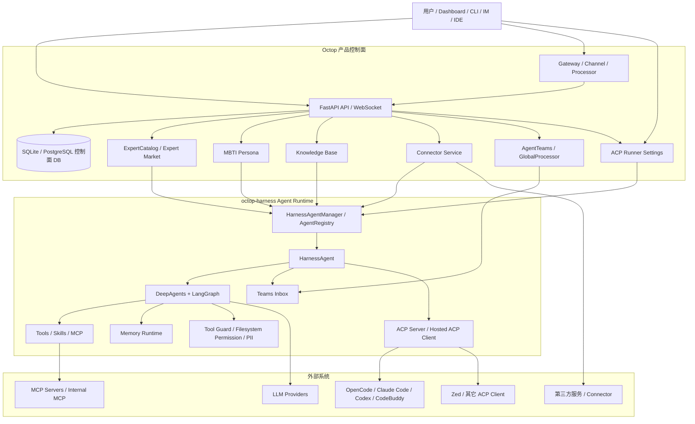

### 这张图最重要的边界

**Octop** 主要负责：

- Agent 是谁
- 归谁拥有
- 使用哪个 Expert
- 使用什么 Persona
- 绑定哪些 Knowledge Base
- 允许哪些 Connector / MCP
- 是否允许 AgentTeams
- 是否允许 ACP runner
- 从 Dashboard / Channel / API 接入
- 如何存控制面状态

**octop-harness** 主要负责：

- Agent 怎么运行
- LangGraph / DeepAgents 怎么执行
- Tool / Skill / MCP 怎么进入模型
- Memory 怎么工作
- 多 Agent Runtime 怎么托管
- Teams peer inbox 怎么执行
- ACP stdio session 怎么维持

这个拆分是整个项目最值得借鉴的地方之一：**Octop 是 Agent Product Platform，harness 是 Agent Runtime。**

---

## 1.2 OctopServer 启动和运行时装配

`OctopServer` 是进程级总 orchestrator。源码中主要装配：

- DB migrations
- `SharedServices`
- `ExpertCatalog`
- `SubagentCatalog`
- `PluginManager`
- `AgentManager`
- `UserManager`
- `Gateway`
- `CronManager`
- `ProactiveCareScheduler`

关键代码：

- `src/octop/infra/server.py`
- `src/octop/infra/agents/manager.py`
- `src/octop/infra/agents/experts/catalog.py`

Agent 的运行时并不是“每次请求重新创建”。`AgentManager` 持有 process-wide 的 harness manager 和 Agent registry，对 Agent 做 start/stop/reload。

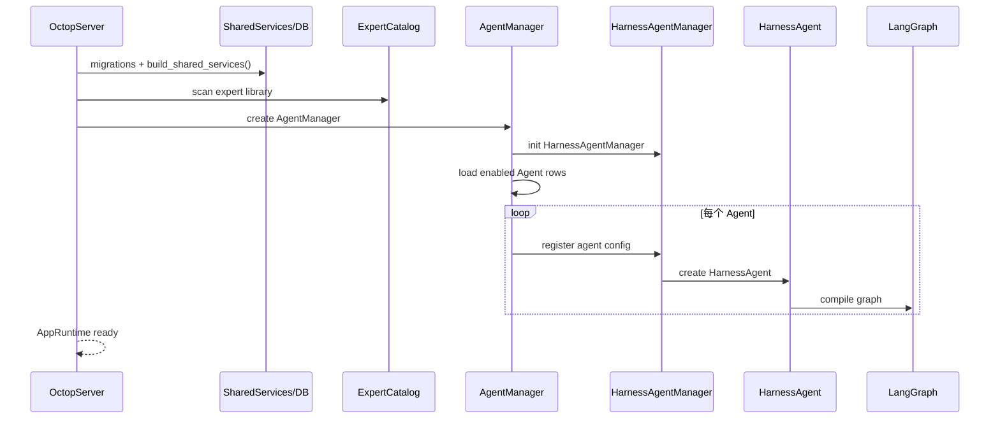

### Hot Reload 是一个重要设计点

Connector、ACP、Security Policy、Provider 等配置发生变化后，Octop 倾向于：

```text
DB/config change
    ↓
reload agent
    ↓
remove old HarnessAgent
    ↓
keep memory/checkpointer where possible
    ↓
rebuild graph
    ↓
re-register runtime
```

这比“每个请求动态判断所有配置”更容易保持运行时确定性。

---

# 2. Agent / Expert / MBTI：三个概念必须分开

这是阅读 Octop 时最容易产生误解的地方。

## 2.1 Agent

Agent 是实际运行实体，有：

- `agent_id`
- `name`
- `user_id`
- `default_model`
- `persona_mbti`
- `system_prompt`
- `template_name`
- `skill_package_ids`
- `knowledge_base_ids`
- `mcp_servers`
- `config/runtime_config`
- `kind`
- workspace
- checkpoint / thread
- channel
- runtime 状态

它才是实际被运行的对象。

---

## 2.2 Expert

Expert 是一个**可复制模板**。

代码位置：

```text
src/octop/infra/agents/experts/
├─ catalog.py
├─ default_agent.py
├─ manifest_generator.py
├─ skillhub_market.py
└─ library/
```

`ExpertCatalog` 启动时扫描：

```text
src/octop/infra/agents/experts/library/
```

每一个 Expert 目录的最核心文件是：

```text
expert-id/
├─ manifest.json
├─ SOUL.md / 其它 prompt files
├─ skills/
├─ agents/
└─ 其它 seed files
```

目录内容最终会被复制进 Agent workspace。

其中 `manifest.json` 不只是显示 metadata。Octop 会把它复制成：

```text
.octop/manifest.json
```

它还负责：

- welcome message
- quick prompts
- task examples
- Expert 元数据
- team manifest 等场景下的 workspace manifest 信息

因此 Expert 更接近：

> **Agent Seed Package / Agent Template**

而不是单纯的 prompt。

---

# 3. MBTI 人格：如何设计和实现

## 3.1 MBTI 真正存的是什么

Octop 没有给每个 MBTI 单独做一个 Agent。

它把 MBTI 做成纯数据模型：

```python
@dataclass(frozen=True)
class MBTIDimensions:
    ei: tuple[str, int]
    sn: tuple[str, int]
    tf: tuple[str, int]
    jp: tuple[str, int]

@dataclass(frozen=True)
class MBTIBehaviorMapping:
    answer_style: str
    casual_chat: str
    conflict: str
    creativity: str
    emotion: str
    planning: str

@dataclass(frozen=True)
class MBTIProfile:
    code: str
    name_zh: str
    name_en: str
    nickname_zh: str
    summary_zh: str
    summary_en: str
    descriptors_zh: str
    descriptors_en: str
    dimensions: MBTIDimensions
    behavior: MBTIBehaviorMapping
    color: str
    symbol: str
```

源码：

`src/octop/infra/agents/persona/mbti_profiles.py`

这说明 Octop 对 Persona 的建模相当克制：

```text
人格 = 数据
而不是
人格 = 一套 Agent Runtime
```

---

## 3.2 16 个 MBTI profile 如何进入模型

运行链路非常直接：

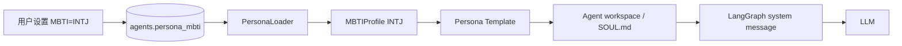

核心代码：

```text
src/octop/infra/agents/persona/mbti_profiles.py
src/octop/infra/agents/persona/loader.py
```

`PersonaLoader.render()` 的三个变量是：

```text
{agent_name}
{user_display}
{custom}
```

其中：

- `agent_name`：Agent 名称
- `user_display`：用户名称
- `custom`：用户配置的 `system_prompt`

---

## 3.3 Persona 的真正“Prompt Shape”

例如 INTJ 最终会被渲染成类似：

```text
# Persona: INTJ — Architect

You are {agent_name}, an AI assistant working with {user_display}.

Imaginative strategist with a plan for everything.
Traits: Strategic, Independent, Insightful, Perfectionist.

## Behavior

- Answer style: Concise and structured; prefers depth over breadth
- Casual chat: Minimal small talk; steers toward ideas and insights
- Conflict: Stays calm and analytical; addresses root cause directly
- Creativity: Systems-level thinking; builds elegant long-term solutions
- Emotion: Acknowledges feelings briefly, then offers pragmatic support
- Planning: Creates detailed strategic roadmaps with contingencies

{custom}
```

最终 `custom` 会被替换为 Agent 自己的 system prompt。

因此 Persona 的优先关系实际是：

```text
MBTI Profile
    ↓
Persona template / SOUL.md backbone
    ↓
Agent-specific system_prompt appended as trim
```

`docs/personas.md` 对这一点有明确说明：**persona 是 backbone，user system prompt 是 trim。**

---

## 3.4 为什么 MBTI 设计得比较轻

这套实现没有：

- Persona Agent class
- Persona-specific tools
- Persona-specific model
- Persona-specific memory
- Persona-specific workflow
- Persona-specific permission model

所以：

```text
INTJ Agent
ESTJ Agent
INFP Agent
```

本质仍然是：

```text
同一个 Harness Runtime
+ 不同的 system/persona 文件
```

这是一种非常容易维护的设计。

### 但它也意味着一个限制

MBTI 主要影响的是**表达行为**，而不是“认知能力”。

例如：

- MBTI 不会自动让 Agent 更会做法律分析
- 不会自动得到更多金融知识
- 不会自动增加工具
- 不会自动增加权限

真正的专业能力应该来自：

```text
Expert
+ Skills
+ Subagents
+ Knowledge Base
+ MCP / Connector
+ model
+ workspace
```

---

# 4. Expert 的完整实现机制

## 4.1 Expert Catalog

`ExpertCatalog.refresh()` 做的事情非常明确：

1. 扫描 library roots
2. 找 `manifest.json`
3. 解析 metadata
4. 找 `prompt_files`
5. 发现 seed paths
6. 生成 `ExpertSummary`
7. 把 Expert 注册到 catalog

而且 catalog 支持：

```text
primary library root
        ↓
optional extra roots / market cache
```

Primary library 优先，因此 Expert Market cache 不会覆盖 builtin Expert。

---

## 4.2 创建 Expert 时发生什么

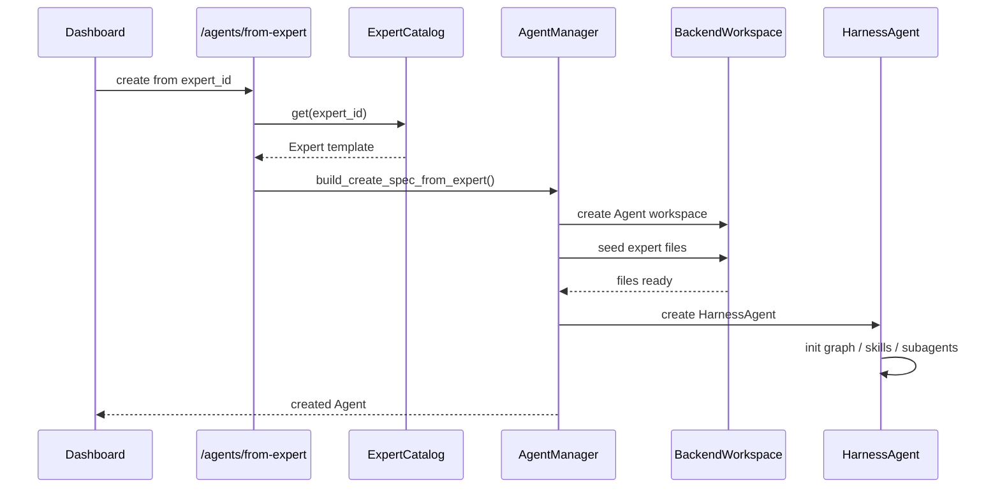

`build_create_spec_from_expert()` 会把：

- name
- description
- template_name
- icon
- color
- welcome
- skill package ids
- knowledge base ids
- mcp servers

组合成 `AgentCreateSpec`。

### 关键判断

Expert 不是“运行时插件”。

它在创建阶段主要完成：

> **把一组经过设计的 Agent Assets seed 进 workspace。**

这就是 Octop 专家体系非常值得借鉴的一点。

---

# 5. AgentTeams：两个层次必须分开

Octop 的 Agent Teams 有两个不同但相关的概念：

## 层次 A：octop-harness 的通用 Peer / Inbox

这是 runtime 能力：

- `agent_list`
- `ask_agent`
- `call_peer`
- `submit_peer`
- `HarnessAgentInboxManager`
- `TeamProcessor`

它解决的是：

> Agent A 如何向 Agent B 发送任务，以及结果如何回到 A。

## 层次 B：Octop 产品里的 `kind=team`

这是产品能力：

> 一个主持 Agent + 多个普通成员 Agent + 一个团队房间。

两者不能混为一谈。

---

# 6. octop-harness Teams：Peer / Inbox 架构

## 6.1 同步协作

普通 Agent 使用：

```text
ask_agent(mode=sync)
        ↓
TeamManager.call_peer()
        ↓
callee.call()
        ↓
直接返回结果
```

适合：

- 快速问一个同事
- 查询某个专家观点
- 当前轮就需要结果

---

## 6.2 异步协作

后台模式：

```text
ask_agent(mode=background)
        ↓
TeamManager.submit_peer()
        ↓
HarnessAgentInboxManager.enqueue()
        ↓
job_id
        ↓
立即返回主 Agent
```

此时主对话可以继续。

随后 Inbox worker：

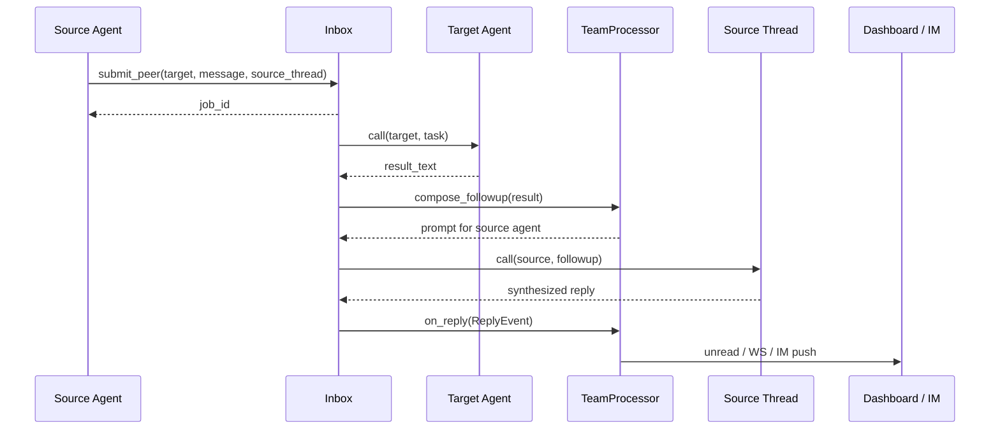

### 最关键的设计

**不是把 Target 的原始结果直接推给用户。**

而是：

```text
Target result
    ↓
compose_followup
    ↓
Source Agent 再理解一次
    ↓
写回 Source Thread
    ↓
用户收到最终答案
```

这比简单的“子 Agent 返回字符串然后直接贴到主聊天”更自然。

---

## 6.3 并发模型

当前 `HarnessAgentInboxManager` 不是旧文档里最早设想的“全局单 worker 串行”。

**当前实现已经进化为：**

- 最大并发 `DEFAULT_INBOX_MAX_CONCURRENCY = 8`
- 同一个 target Agent 有 lock，因此同一个 callee 串行
- 不同 target 可以并行
- source thread 有 lock，因此同一个主会话的多个回叫串行

这点非常重要：

```text
         ┌─ Agent B ── serial
Agent A ─┼─ Agent C ── parallel
         └─ Agent D ── parallel

回到 A 的同一 thread：serial
```

这是比“全局单 worker”更合理的 V2 实现。

---

# 7. Octop AgentTeams：主持人 + 成员 + 房间

## 7.1 Team 不是独立的数据实体

`docs/expert-teams.md` 直接定义：

```text
agents.kind = team
```

主持人本身就是一条 Agent。

成员列表不通过独立 Team Members 表持久化，而是写在主持人 workspace 的：

```text
.octop/manifest.json
```

例如：

```json
{
  "kind": "team",
  "members": ["expert-a", "expert-b"]
}
```

这是一个非常值得注意的建模选择：

> **Team = 一种特殊 Agent，而不是和 Agent 平行的一级实体。**

---

## 7.2 Team 的运行时拓扑

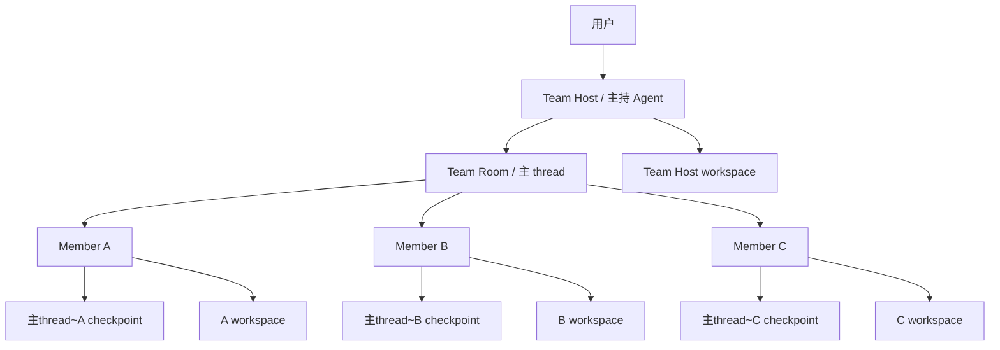

### 这里的核心原则

**成员不共享 checkpoint。**

主持人的 thread：

```text
conversation_id = host_thread_id
```

成员：

```text
host_thread_id~member_id
```

这样每个 Agent 的 LangGraph history 仍然隔离。

---

# 8. AgentTeams 协作机制

## 8.1 主持人不做专业工作

当前设计明确规定：

> 主持人只负责调度；专业工作一律异步派给成员。

主持人可以：

- 判断要不要派工
- 选择成员
- 并行 dispatch
- 汇总
- 判断是否收工

而成员：

- 真正执行任务
- 使用自己的 workspace
- 使用自己的 skill / MCP / knowledge / tool
- 产出结果后回叫主持人

---

## 8.2 一轮并行派工

典型流程：

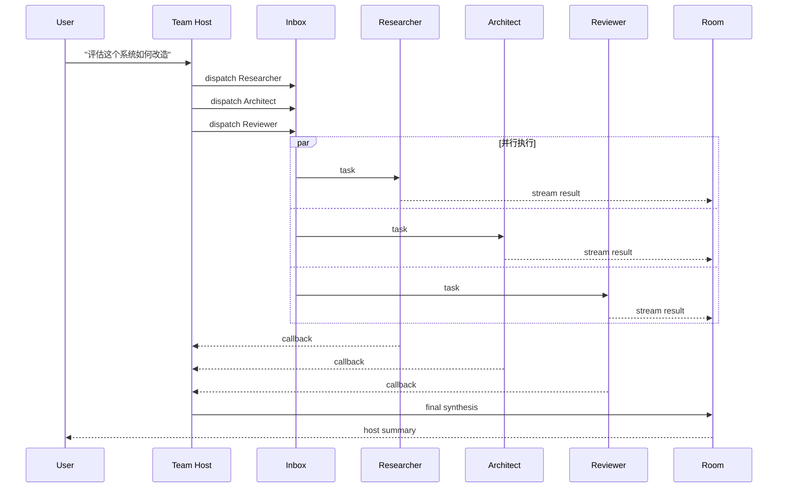

真正做“并行执行”的是 inbox / target locks，而不是共享一个 Agent graph。

---

## 8.3 为什么成员结果直接上墙

团队聊天被设计成“真群聊”：

- 成员气泡直接进时间线
- 每个消息带 `speaker_agent_id`
- 前端根据 `speaker_agent_id` 显示头像和名字

因此它不是：

```text
Host:
成员 A 说 xxx
成员 B 说 yyy
```

而是：

```text
[A Researcher] xxx
[B Architect] yyy
[Host] 综合结论...
```

这实际上是一个 **event / message fan-out + speaker attribution** 设计。

---

## 8.4 用户消息仍然只进入 Host

即使成员正在执行：

```text
User -> Host
```

不会把用户的新消息直接广播给所有成员。

好处是：

- 主持人是唯一“控制器”
- 不会多 Agent 同时理解用户新意图
- Team 的工作可以由 Host 统一重新规划

---

# 9. Connector 拓展体系

这是 Octop 最工程化、最完整的一块。

## 9.1 Connector 的核心数据结构

`ConnectorCatalogEntry` 大致表达：

```text
kind
name
description
auth_kind
doc_url
icon
color
phase
mcp_mode
category
quick_auth_url
login_url
guide_url
manual_url
auth_hint
allowed_tools
oauth_issuer
mcp_url
oauth_resource
oauth_scopes
credential_fields
remote_transport
```

可以把它理解成：

> **Connector 的静态 capability manifest**

代码：

`src/octop/infra/connectors/catalog.py`

---

## 9.2 三种 mcp_mode

这是理解整个 Connector 架构的关键。

### 1. remote

Harness 直接访问第三方 MCP。

```text
Harness
  ↓ HTTP/SSE
Vendor MCP
```

例子：

- Notion
- 腾讯文档
- 微信读书
- 腾讯会议

---

### 2. gateway

工具在 Octop Python 进程内实现。

```text
Harness
  ↓
Python adapter
  ↓
Vendor API / SDK
```

这种模式没有真正的远程 MCP transport。

因此 builder 会注册一个 name-only placeholder，之后通过 Python 注入 tools。

典型：

- 邮箱
- 腾讯 IMA
- 部分旅游/地图服务
- 飞书 CLI
- 企业微信 CLI

---

### 3. internal

Octop 自己提供一个内部 HTTP MCP Gateway。

```text
Harness
  ↓ HTTP
/api/internal/mcp/...
  ↓
Octop Connector Gateway
  ↓
Vendor MCP/API
```

典型：企查查 QCC。

这样做的意义是：

- 凭证留在 Octop
- Harness 不直接持有上游 vendor credential
- 可以做统一刷新 / 聚合 / 工具 allowlist
- 上游多个 MCP Server 可以被聚合到一个 connector instance

---

## 9.3 Connector 完整生命周期

```mermaid
flowchart LR
    Catalog[Connector Catalog]
    Create[Create Instance]
    Cred[Credential Validation]
    OAuth[OAuth / PKCE / DCR]
    Store[(Encrypted Credential Blob)]
    Probe[Probe / Tool Discovery]
    Builder[MCP Builder]
    Config[Harness MCP Config]
    Reload[Agent Reload]
    Tools[Agent Tools]
    Chat[Chat Turn]

    Catalog --> Create
    Create --> Cred
    Cred --> OAuth
    Cred --> Store
    OAuth --> Store
    Store --> Probe
    Probe --> Builder
    Builder --> Config
    Config --> Reload
    Reload --> Tools
    Tools --> Chat
```

---

## 9.4 Credentials 怎么保存

DB 中 Connector instance row 至少包含：

```text
credential_blob
credential_expires_at
credential_rotated_at
config_json
status
shared
mcp_server_name
```

原始 credentials 不直接放在 Agent config 里。

Connector Service 负责：

```text
encrypt
store
decrypt
refresh
revoke
```

这是一种很重要的分层：

```text
Agent config
    ≠
Connector secret
```

而是：

```text
Agent
  ↓ references connector instance
Connector Service
  ↓ decrypt only when building tool/MCP
Runtime
```

---

# 10. Connector OAuth 设计

Octop 的 MCP OAuth 已经不是简单的“复制 token”。

支持：

- OAuth 2
- PKCE
- Dynamic Client Registration（DCR）
- Protected Resource Metadata
- refresh token
- revoke

比如 QCC：

```text
Browser
  ↓
QCC Authorization Server
  ↓ authorization code
Octop callback
  ↓
exchange
access_token + refresh_token
  ↓
encrypted persistence
```

并且：

- 401 会尝试 refresh
- 并发 refresh 有锁
- 删除 OAuth instance 会尝试 remote revoke

### 一个重要的工程边界

QCC 文档明确指出：

> refresh lock 只覆盖同一进程/同一个 repository object，不解决多 worker / 多副本下 rotating refresh token 的跨进程协调。

这说明项目作者已经明确意识到“本地单进程产品”和“真正多副本生产部署”之间的差异。

---

# 11. Connector Tool Allowlist

Connector 不一定把上游 MCP 全量工具给模型。

`allowed_tools` 可用于限制暴露工具。

例如腾讯文档 / 微云有精选工具列表。

最终 MCP spec 类似：

```json
{
  "transport": "http",
  "url": "...",
  "headers": {...},
  "allowed_tools": [
    "search",
    "read",
    "create"
  ]
}
```

这对于企业 Agent 特别重要：

> **连接一个系统 != 把这个系统所有操作权交给模型。**

---

# 12. Connector 与 Agent Reload

Connector 发生以下变化后通常会触发 Agent reload：

- 新增 connector
- 删除 connector
- 更新 credentials
- active / disabled
- default_open
- shared

流程：

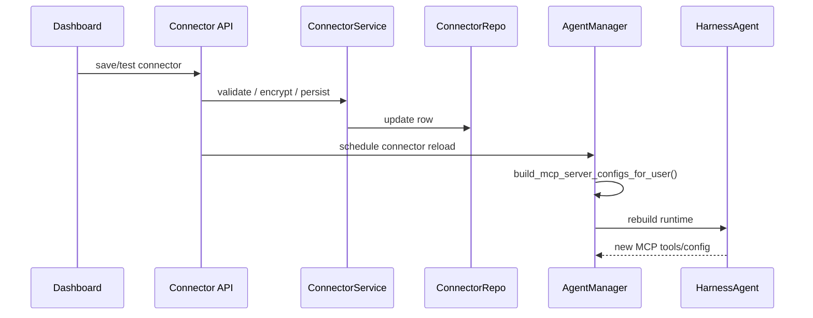

因此 Connector 并不是“模型每次调用时查 DB”。

它更接近：

```text
Control plane update
    ↓
Runtime reconfiguration
    ↓
New graph/tool environment
```

---

# 13. Custom MCP：扩展体系的最后一层

除了 catalog connector，Octop 还支持：

```text
custom-mcp
```

接口：

- `PUT /connectors/custom-mcp`
- `PATCH /connectors/custom-mcp/servers/{name}`
- `POST /connectors/custom-mcp/test`

Custom MCP 支持：

- 自定义 HTTP MCP
- 保存 server spec
- probe
- enabled / default_open
- OAuth discovery

因此整个 Connector 体系实际上是：

```text
Builtin Connector Catalog
        │
        ├─ remote MCP
        ├─ gateway adapter
        └─ internal MCP

Custom MCP
        │
        ├─ raw HTTP MCP
        └─ OAuth-capable MCP
```

这已经形成了一个真正的“扩展协议层”。

---

# 14. Knowledge Base 架构

## 14.1 三部分组成

Octop Knowledge Base 不是单一数据库。

它由三块组成：

```text
             Knowledge Base
          ┌──────────────────┐
          │ Control Plane DB │
          │                  │
          │ KB metadata      │
          │ Document rows    │
          │ owner/shared     │
          │ embedding config │
          └────────┬─────────┘
                   │
        ┌──────────┴──────────┐
        ↓                     ↓
Original Files          Vector Sidecar
knowledge/<kb>/docs/    knowledge/<kb>/index.sqlite
```

源码：

```text
src/octop/infra/knowledge/service.py
src/octop/infra/knowledge/files.py
src/octop/infra/knowledge/index.py
src/octop/infra/db/repos/knowledge.py
```

---

## 14.2 Knowledge Base 元数据

`KnowledgeBaseRow` 包括：

```text
id
owner_user_id
name
description
default_open
shared
icon_name
embedding_model
embedding_dim
doc_count
max_documents
created_at
updated_at
```

文档 row 包括：

```text
document_id
kb_id
path
filename
is_dir
content_type
byte_size
content_hash
status
error_message
chunk_count
created_at
updated_at
```

这意味着知识库控制面是结构化的，原始文本不是直接塞 DB blob。

---

# 15. 如何添加知识

当前支持：

### 直接上传

包括：

- txt
- md
- markdown
- rst
- html
- json/jsonl
- yaml/yml
- csv/tsv
- PDF
- DOCX
- PPTX
- XLS/XLSX/XLSM
- PNG/JPG/JPEG/WEBP（OCR 开启后）

### 在线创建 Markdown / TXT

特别值得关注：

```text
CreateTextDocumentBody
    ↓
.md / .txt
    ↓
可编辑
    ↓
修改后 status=pending
    ↓
重新 index
```

因此知识不仅是“一次性文件上传”，而是有轻量的维护机制。

---

# 16. Knowledge 的解析机制

`parse_document()` 根据扩展名选择解析器。

大致是：

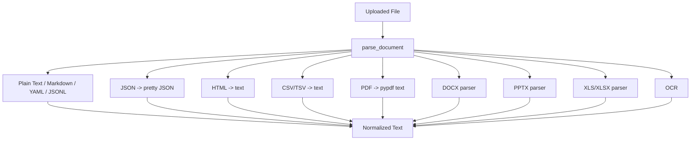

PDF 在抽取不到文本并且 OCR 开启时会 fallback 到 OCR。

---

# 17. Chunking：当前实现其实非常简单

默认参数：

```text
chunk_size = 800 chars
chunk_overlap = 120 chars
```

算法：固定字符窗口。

```python
step = size - overlap
for start in range(0, len(content), step):
    chunk = content[start:start + size]
```

所以当前没有：

- semantic chunking
- heading-aware chunking
- sentence boundary chunking
- table-aware chunking
- graph chunking

这说明 Octop Knowledge Base 的重点不是“高级 RAG”，而是：

> **把本地 Agent 产品的文档 grounding 做成一个可靠、简单、可维护的基础能力。**

---

# 18. Embedding 架构

支持两种 backend：

```text
ONNX local
    或
Remote embedding provider
```

代码：

`src/octop/infra/knowledge/embed.py`

远程 embedding 接口采用 OpenAI-compatible：

```text
POST /embeddings
```

并且 batch 上限控制为 20。

---

# 19. Vector Index：为什么说它“轻”

每个知识库一个：

```text
index.sqlite
```

表结构：

```text
chunks(
  chunk_id,
  doc_id,
  ordinal,
  text,
  embedding BLOB,
  meta_json
)
```

embedding 存为：

```text
float32 binary blob
```

检索时：

1. 查询向量
2. 加载全部 chunks
3. Python 中逐 chunk 算 cosine similarity
4. 排序
5. 取 top-k

伪代码：

```text
query_vector
    ↓
SELECT all chunks
    ↓
for each chunk:
    cosine(query, embedding)
    ↓
sort desc
    ↓
top-k
```

### 优点

- 零额外向量数据库
- 单机部署非常简单
- 随 KB 一起复制
- 易备份
- 易测试

### 缺点

- chunk 数量大后会变成 O(N) 扫描
- 没有 ANN index
- 没有 hybrid BM25
- 没有 reranker
- 没有 cross-encoder
- 没有 query expansion

所以它非常适合：

> 个人 / 单机 / 中小知识库

但不适合直接承载百万级 chunk 的企业级 RAG。

---

# 20. Knowledge Retrieval

知识检索分两条路径：

### 自动 / middleware-style grounding

对话可以把选中的 KB 作为本轮上下文来源。

### Tool-based on-demand retrieval

Harness 内置：

```text
search_knowledge
```

Tool 会从 LangGraph configurable 读取：

```text
user
user_is_admin
knowledge_base_ids
locale
```

然后调用 `retrieve_context()`。

---

# 21. Knowledge Access Control

读取权限：

```text
owner
OR shared
OR admin
```

写入权限：

```text
owner
OR admin
```

因此 Shared Knowledge Base 是：

> **共享读取，不是共享写入。**

这是一个很合理的默认安全模型。

---

# 22. Knowledge 的“表达方式”到底是什么

这是用户特别值得关注的一点。

Octop 当前并没有一个独立的 `KnowledgeAtom / Entity / Ontology / SemanticFact` 数据模型。

它的知识表达实际上是：

```text
原始文档
    ↓
提取文本
    ↓
chunk
    ↓
embedding
    ↓
vector hit
    ↓
context text + citation marker
```

所以：

### 当前 Knowledge representation = document-grounded semantic retrieval

而不是：

```text
知识 = Entity + Relation + Rule + Definition
```

也不是：

```text
知识 = typed semantic layer
```

这点对设计企业 Agent 知识层非常重要：Octop 的 Knowledge Base 是“RAG Corpus”，不是“业务语义层”。

---

# 23. Knowledge Citation

检索结果会额外附带 machine-readable marker：

```text
<!--octop-kb-citations:[...]-->
```

里面保存：

```text
kb_id
kb_name
doc_id
filename
path
```

这样 Dashboard 可以：

- 展示“来源文档”
- 点击回知识库
- 不需要依赖 LLM 正确生成 citation

这是一个很好的设计：

> **引用 metadata 不依赖模型自己编 markdown。**

---

# 24. Knowledge 的维护机制

一个文档进入知识库后：

```text
upload
  ↓
DB row status=pending
  ↓
write original file
  ↓
enqueue index job
  ↓
parse
  ↓
chunk
  ↓
embed
  ↓
replace document chunks atomically
  ↓
status=ready
```

失败：

```text
status=failed
error_message=...
```

如果服务重启：

```text
resume_pending_index_jobs()
```

这说明项目对“索引任务生命周期”有基本工程化考虑。

---

# 25. ACP 双向集成

Octop 文档把 ACP 明确拆成两条方向：

| 方向 | ACP Server | ACP Client | 目的 |
|---|---|---|---|
| Inbound | Octop | Zed / OpenCode / IDE | 外部工具驱动 Octop Agent |
| Outbound | OpenCode / Claude Code / Codex 等 | Octop | Octop Agent 委派编码任务 |

两边当前都走：

> **stdio JSON-RPC**

并不是 HTTP ACP。

源码/文档：

`docs/acp.md`

---

# 26. Outbound ACP：对话中委派给 OpenCode

## 26.1 最关键的事实

OpenCode 的内置 runner 定义是：

```json
{
  "command": "opencode",
  "args": ["acp"]
}
```

所以实际机制是：

```text
Octop Agent
   ↓ tool call
acp_runner(action=start, runner=opencode, ...)
   ↓
ACPService
   ↓
spawn_agent_process()
   ↓
local process: opencode acp
   ↓ stdio JSON-RPC
OpenCode ACP server
```

也就是说：

> **Octop 并没有通过某个 OpenCode HTTP API 来“调用应用”。**

它启动 OpenCode 的 ACP 子进程，并通过标准输入/输出进行 ACP 双向通信。

---

# 27. ACP Runner 的配置模型

Runner 分两层：

### 用户级

保存在：

```text
settings
acp_runners:user:{id}
```

用于保存：

- command
- args
- env
- enabled
- trusted
- tool parse mode
- stdio buffer limit

### Agent 级

只保存：

```text
config_json.acp.tool_enabled
```

这意味着：

```text
Runner definition = user-global
Tool availability = per-agent
```

这个设计是很好的：

> OpenCode 只需要配置一次，多个 Agent 可以共享这个 runner；但不是所有 Agent 都必须有 `acp_runner` 工具。

---

# 28. acp_runner Tool

定义在：

`octop-harness/src/octop_harness/builtin/tools/acp_runner.py`

支持：

```text
action=list
action=status
action=start
action=message
action=respond
action=close
```

典型流程：

```text
list
 ↓
start
 ↓
message
 ↓
permission_required ?
 ↓ yes
respond(option_id)
 ↓
message...
 ↓
close
```

---

# 29. ACP Session Model

ACP session 的 key 是：

```text
(thread_id, runner)
```

内存中维护：

```python
_sessions[(thread_id, runner)] = _Conversation(...)
```

`_Conversation` 保存：

- thread id
- runner name
- ACP session id
- cwd
- ACP connection
- process
- client
- exit stack
- turn lock
- prompt task

这就是为什么用户在同一个 Chat Thread 中可以连续：

```text
start OpenCode
   ↓
message
   ↓
message
   ↓
message
```

而不是每次重新启动 OpenCode。

---

# 30. ACP 与 OpenCode 的实际时序

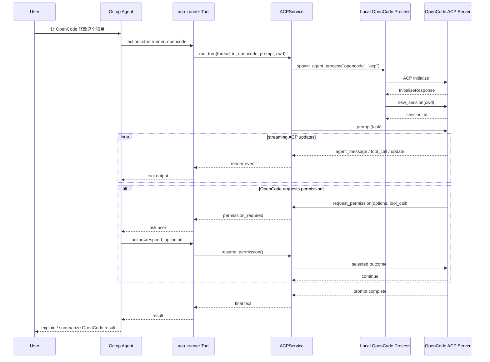

---

# 31. ACP Permission Gate

这是 outbound ACP 最重要的安全机制之一。

`ACPPermissionAdapter` 会把外部 Agent 的权限请求转换成：

```text
SuspendedPermission
```

里面包含：

- tool name
- tool kind
- target
- action
- summary
- command
- paths
- options
- requires_user_confirmation

然后通过：

```text
permission_required
```

返回到 Octop 对话。

用户选择 option id 后：

```text
acp_runner(action=respond, message=<exact option id>)
```

再 resume OpenCode session。

---

# 32. Hard Block 与 Permission 不一样

Octop 不只是把权限弹窗原样传回来。

`ACPPermissionAdapter` 自己还做了 hard block：

```text
rm -rf /
sudo rm -rf
mkfs
dd if=
```

以及路径越界检查。

因此 ACP 实际是：

```text
External Agent
      ↓
ACP permission request
      ↓
Octop permission adapter
      ├─ hard blocked → cancelled
      └─ allowed candidate → user approval
```

这也是一个非常值得借鉴的边界：

> **外部 Agent 的“权限协议”不能直接等于宿主的“安全策略”。**

---

# 33. ACP Inbound：让 Zed / OpenCode 使用 Octop Agent

反方向则是：

```bash
octop acp --agent main
```

Octop 自己变成 ACP Server。

```text
Zed / OpenCode
     ↓ stdio ACP
octop acp
     ↓
HarnessACPAgent
     ↓
HarnessAgent.stream()
     ↓
LangGraph / LLM / Tools
```

`HarnessACPAgent` 会把 harness stream 的 chunk 转成 ACP：

- text → `AgentMessageChunk`
- reasoning → `AgentThoughtChunk`
- tool call → `ToolCallStart` / `ToolCallProgress`

所以 ACP 在这里充当的是一个**运行时互操作协议**，而不是新的 Agent framework。

---

# 34. ACP 双向集成的整体架构

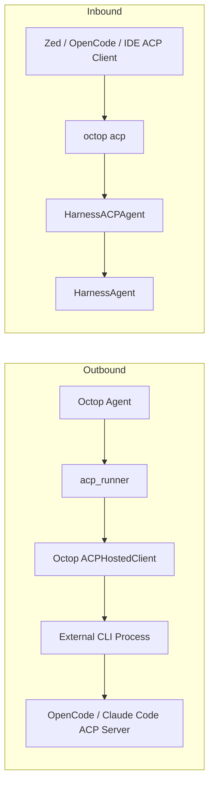

---

# 35. Octop 的 ACP 为什么不是“简单 CLI wrapper”

因为它已经有完整的 session runtime：

```text
runner registry
session lifecycle
thread binding
permission suspension
permission resume
stream conversion
cancel
close
process tree cleanup
```

同时还做了：

- `.env` overlay
- runner-specific env
- stdio buffer limit
- timeout
- process cleanup
- session state

所以 `acp_runner` 更准确的定义是：

> **Agent Runtime Delegation Layer**

而不是“执行一次 shell command”。

---

# 36. 六个核心能力放在一起后，Octop 的真正架构模型

如果把本报告的六项能力全部抽象，可以得到下面的模型：

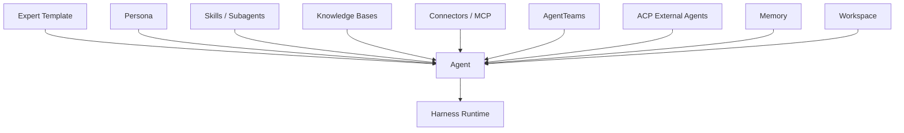

这其实是一种非常清楚的 Agent Composition 模型：

```text
Agent =
    Identity
  + Persona
  + Template/Expert
  + Skills
  + Knowledge
  + Connectors
  + Memory
  + Workspace
  + Collaboration
  + External Delegation
  + Runtime
```

---

# 37. 十分值得借鉴的设计

## 37.1 Expert 用 workspace assets 表达，而不是把一切硬编码进数据库

这是最重要的一条。

Expert 可以自然包含：

```text
SOUL.md
AGENTS.md
skills/
agents/
manifest.json
```

它非常适合把“专家知识”变成 repo-like artifact。

相比：

```text
expert table
prompt column
skill_ids
tool_ids
knowledge_ids
```

这种纯数据库建模更适合人类编辑和版本控制。

---

## 37.2 MBTI 做成数据，而不是 Agent 类型

这是一个很好的 KISS 设计：

```text
Persona = prompt layer
```

不要把 persona 扩散到 runtime。

---

## 37.3 Connector 的 remote/gateway/internal 三态模型

这是 Connector 系统最值得复制的设计。

很多系统容易把所有 connector 都设计成：

```text
mcp_url + api_key
```

但实际生产中：

```text
remote MCP
local adapter
internal gateway
```

三种情况完全不同。

Octop 已经把这个差异显式写进：

```text
mcp_mode
```

而不是让代码到处 if/else 猜。

---

## 37.4 ACP runner 全局定义 + Agent enable toggle

这是非常好的资源模型：

```text
Runner definition
    = user-level resource

Tool enabled
    = agent-level capability
```

与 Connector 的“instance resource + agent binding”思路高度一致。

---

## 37.5 Team 房间不污染 Agent checkpoint

这是 AgentTeams 最值得借鉴的地方。

没有做：

```text
所有 Agent → 一个 shared thread
```

而是：

```text
Room
├── Host checkpoint
├── A checkpoint
├── B checkpoint
└── C checkpoint
```

再通过：

```text
speaker_agent_id
```

做消息层聚合。

这实际上把：

```text
conversation view
```

和：

```text
agent execution state
```

分开了。

---

# 38. 当前实现的限制与风险

## 38.1 Team Inbox 仍是进程内状态

`HarnessAgentInboxManager` 的消息、任务状态、worker 都在内存。

因此：

```text
process restart
    ↓
queued/running jobs lost
```

文档也明确承认：如果需要持久化队列，应在 harness 层做，而不是复制到 Octop DB。

### 这对企业场景意味着

需要独立增加：

- durable queue
- job status store
- retry policy
- idempotency key
- dead letter queue

才能做到生产级长期任务。

---

## 38.2 Knowledge Index 不是企业级向量搜索引擎

当前是：

```text
SQLite + BLOB + Python cosine scan
```

非常适合简单部署，但规模上去以后需要：

- pgvector
- Milvus
- Qdrant
- Elasticsearch/OpenSearch hybrid
- Snowflake vector search
- 或其它 ANN

---

## 38.3 Knowledge representation 仍然是 RAG corpus

缺少：

```text
Business Definition
Metric Definition
Entity
Relation
Rule
Policy
Workflow
Provenance
Validity Period
Owner
```

因此如果企业真正的目标是“让 Agent 遵循公司业务定义”，Octop Knowledge Base 只能作为第一层 evidence store，不能代替 semantic/business layer。

---

## 38.4 MBTI 对专业能力影响很小

它主要影响语言行为和处理风格。

如果要让：

```text
Legal Expert
Portfolio Manager
Data Architect
Security Reviewer
```

体现专业差异，真正应该放在：

```text
Expert Assets
Skills
Subagents
Knowledge
MCP
Policies
```

而不是 MBTI。

---

## 38.5 ACP outbound 的能力取决于本机 CLI

例如 OpenCode runner 的前提是：

```text
opencode
```

必须在 Octop 执行环境中可运行。

所以：

```text
Octop server container
```

和：

```text
用户本机
```

如果不是同一个环境，就无法天然做到“调用用户本机 OpenCode”。

这正是 ACP stdio 方式的物理边界。

---

# 39. 对“通过 RPC 直接调用本机 Claude/OpenCode”的重要启示

从 Octop 当前实现可以得到一个非常清晰的判断：

### OpenCode 场景

Octop 选择：

```text
local process spawn
    + ACP stdio
```

而不是：

```text
HTTP API key
```

这是很合理的，因为 ACP 本身提供了：

- session
- prompt
- tool call
- permission
- streaming
- cancel

### 对其它 Coding Agent

只要存在：

```text
<agent CLI> + ACP server
```

就可以把它接入 Octop，而无需 Octop 理解这个 coding agent 的内部 RPC。

这就是 ACP 真正的扩展价值：

> **协议标准化了“如何把另一个 Agent 当成可委派 Agent”，而不是标准化某个供应商 API。**

---

# 40. 源码目录索引

## Octop

### Agent / Expert

```text
src/octop/infra/agents/manager.py
src/octop/infra/agents/expert_catalog.py
src/octop/infra/agents/experts/catalog.py
src/octop/infra/agents/experts/default_agent.py
src/octop/infra/agents/experts/skillhub_market.py
```

实际重点：

```text
src/octop/infra/agents/experts/
```

### Persona

```text
src/octop/infra/agents/persona/mbti_profiles.py
src/octop/infra/agents/persona/loader.py
```

### Teams

```text
docs/expert-teams.md
docs/agent-call-agent.md
docs/agent-delegation.md
docs/agent-interop-mailbox.md
```

### Connector

```text
src/octop/infra/connectors/catalog.py
src/octop/infra/connectors/service.py
src/octop/infra/connectors/builder.py
src/octop/infra/connectors/probe.py
src/octop/infra/connectors/custom_mcp.py
src/octop/infra/connectors/oauth/
src/octop/infra/connectors/gateway/
src/octop/infra/db/repos/connectors.py
```

### Knowledge

```text
src/octop/infra/knowledge/service.py
src/octop/infra/knowledge/jobs.py
src/octop/infra/knowledge/parse.py
src/octop/infra/knowledge/chunk.py
src/octop/infra/knowledge/embed.py
src/octop/infra/knowledge/index.py
src/octop/infra/knowledge/retrieve.py
src/octop/infra/knowledge/citations.py
src/octop/infra/knowledge/tools.py
src/octop/infra/knowledge/files.py
src/octop/infra/db/repos/knowledge.py
```

### ACP

```text
docs/acp.md
src/octop/api/routers/acp.py
src/octop/infra/agents/settings/acp.py
src/octop/cli/commands/acp.py
```

## octop-harness

### Runtime

```text
src/octop_harness/agent.py
src/octop_harness/manager.py
src/octop_harness/registry.py
```

### Teams

```text
src/octop_harness/teams/inbox.py
src/octop_harness/teams/team_manager.py
src/octop_harness/teams/processor.py
src/octop_harness/teams/tools.py
src/octop_harness/teams/util.py
src/octop_harness/teams/profile.py
```

### ACP

```text
src/octop_harness/acp/models.py
src/octop_harness/acp/service.py
src/octop_harness/acp/client.py
src/octop_harness/acp/server.py
src/octop_harness/acp/permissions.py
src/octop_harness/builtin/tools/acp_runner.py
```

---

# 41. 关键文档索引

| 文档 | 作用 |
|---|---|
| `README.md` / `README_CN.md` | 项目整体能力、层次和安装说明 |
| `docs/architecture.md` | Octop 总体架构 |
| `docs/personas.md` | MBTI / Persona 实现 |
| `docs/expert-teams.md` | 产品级 AgentTeams |
| `docs/agent-call-agent.md` | 普通 Agent peer call |
| `docs/agent-delegation.md` | 后台异步协作 |
| `docs/agent-interop-mailbox.md` | Teams Inbox + Callback 设计 |
| `docs/acp.md` | ACP 双向集成 |
| `docs/connectors-qcc.md` | Internal MCP / OAuth 示例 |
| `docs/connectors-agently-mail.md` | Gateway Connector / HITL 示例 |
| `docs/api.md` | API / 资源边界 |

---

# 42. 一句话理解每一层

如果要把 Octop 讲给架构师，可以直接这样概括：

```text
Expert
= 怎么成为某类 Agent

MBTI
= 用什么人格风格工作

Skill / Subagent
= 怎么干活

Knowledge Base
= 去哪里找私有知识

Connector
= 能操作哪些外部系统

AgentTeams
= 和哪些 Agent 协作

ACP
= 把工作委派给外部 Agent / 被外部 Agent 调用

Workspace
= Agent 的长期可编辑资产

Memory
= Agent 的长期记忆

Harness
= 上面所有东西到底怎么运行
```

这套拆分已经相当接近一个成熟的 Agent OS / Agent Platform 模型。

---

# 43. 最终判断

## 43.1 Octop 最强的地方

### 第一：能力组合方式清楚

它没有把所有能力都做成一个巨大的 Agent class，而是：

```text
Agent
  + Persona
  + Expert
  + Skills
  + Knowledge
  + Connector
  + Teams
  + ACP
```

### 第二：外部能力的生命周期比较完整

尤其 Connector 和 ACP，都不是“把某个工具注册进去”那么简单，而是包含：

```text
配置
→ credential
→ runtime binding
→ permission
→ execution
→ reload
→ cleanup
```

### 第三：AgentTeams 的 execution state 和 conversation view 分离

这是最值得借鉴的架构点之一。

---

## 43.2 Octop 当前最明显的能力边界

### Knowledge 仍然是 RAG，不是企业语义层

如果目标是：

> “Agent 必须遵守企业业务定义、数据口径、权限规则和标准工作流。”

那么 Octop 当前 Knowledge Base 仍然不足。

它更适合：

```text
Evidence / Document Retrieval Layer
```

而不是：

```text
Business Semantic Layer
```

### Teams 仍偏 runtime collaboration

虽然协作机制已经不错，但 durable workflow / long-running orchestration / job persistence 还不是它的中心设计。

### ACP 很适合“本机 Agent-to-Agent”，但不天然解决远程桌面调用

它解决的是协议问题，不解决“OpenCode 到底跑在哪里”的部署问题。

---

# 44. 对下一代企业 Agent 平台最值得提取的模式

综合这两个仓库，最值得抽出来形成通用 library 的并不是“MBTI”，而是下面这些模式：

```text
1. Agent Template / Expert Asset Package
2. Persona as Prompt Layer
3. Capability Catalog
4. Credential Store + Runtime Binding
5. Connector = remote / gateway / internal
6. Knowledge Corpus + Citation Provenance
7. Peer Collaboration = sync call / async inbox
8. Team Room ≠ Agent Checkpoint
9. External Agent Delegation via ACP
10. User-level runner definition + Agent-level capability toggle
11. Hot reload instead of per-turn config lookup
12. Host callback as framework extension point
```

其中最值得长期保留的抽象边界是：

```text
                    Control Plane
                         │
       ┌─────────────────┼─────────────────┐
       │                 │                 │
    Agent/Expert      Connector          Knowledge
       │                 │                 │
       └─────────────────┼─────────────────┘
                         ↓
                    Runtime Config
                         ↓
                  octop-harness
                         ↓
              LangGraph / DeepAgents
                         ↓
        ┌────────────────┼────────────────┐
        │                │                │
      Tools           Teams             ACP
        │                │                │
        ↓                ↓                ↓
      World           Agents          External Agents
```

这比单纯把所有东西统一抽象成“Tool”更适合企业 Agent 平台。

---

# 45. 主要原始资料

## Octop

- Repository: https://github.com/TencentCloud/Octop
- Architecture: https://github.com/TencentCloud/Octop/blob/main/docs/architecture.md
- Personas: https://github.com/TencentCloud/Octop/blob/main/docs/personas.md
- Expert Teams: https://github.com/TencentCloud/Octop/blob/main/docs/expert-teams.md
- Agent Call: https://github.com/TencentCloud/Octop/blob/main/docs/agent-call-agent.md
- Agent Delegation: https://github.com/TencentCloud/Octop/blob/main/docs/agent-delegation.md
- Agent Interop Mailbox: https://github.com/TencentCloud/Octop/blob/main/docs/agent-interop-mailbox.md
- ACP: https://github.com/TencentCloud/Octop/blob/main/docs/acp.md
- API: https://github.com/TencentCloud/Octop/blob/main/docs/api.md
- QCC Connector: https://github.com/TencentCloud/Octop/blob/main/docs/connectors-qcc.md
- Agent Mail Connector: https://github.com/TencentCloud/Octop/blob/main/docs/connectors-agently-mail.md

## octop-harness

- Repository: https://github.com/TencentCloud/octop-harness
- Chinese README: https://github.com/TencentCloud/octop-harness/blob/main/README_CN.md
- Teams Inbox: https://github.com/TencentCloud/octop-harness/tree/main/src/octop_harness/teams
- ACP: https://github.com/TencentCloud/octop-harness/tree/main/src/octop_harness/acp

---

# 46. 最终结论

Octop 的核心价值不是某一个功能点，而是一套已经比较完整的 **Agent Composition Architecture**：

> **用 Expert 定义 Agent 的初始形态，用 Persona 定义行为风格，用 Skill/Tool/MCP 定义能力，用 Knowledge 定义私有知识来源，用 Teams 定义内部协作，用 ACP 定义外部 Agent 协作，再由 octop-harness 负责真正执行。**

其中最值得进一步抽象成通用 Agent 基础设施的，是：

```text
Expert Asset Package
+
Capability Catalog
+
Runtime Binding
+
Peer/Team Collaboration
+
External Agent Protocol
```

而 Knowledge Base 则应该被看成一个“可靠的文档 Grounding 基础组件”，不能直接等同于企业语义层、业务知识模型或治理语义层。

ACP 部分则已经证明一个很重要的工程方向：**外部 coding agent 不一定需要 secret token API；只要它提供标准 ACP Server，宿主 Agent 就可以通过本地进程 + stdio + session + permission callback 把它当成另一个可委派 Agent。**

