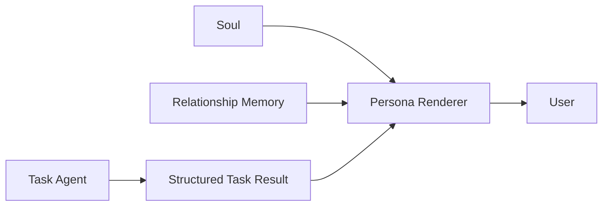

# ADR-0001: 将 Agent Soul 与任务推理、Relationship Memory 解耦

- Status: Accepted
- Date: 2026-10-06
- Decision scope: Agent personality, long-term relationship memory, final answer rendering

## Context

项目中的 Agent 同时承担任务执行和长期陪伴角色。实践和研究表明，人格信息可能影响模型的任务推理，即使这些人格信息与当前任务无关。因此，把 Soul 直接放进 Task Agent 的 system prompt 存在不必要的性能和正确性风险。

另一方面，长期运行的本机 Agent 又需要保持稳定的身份、说话风格和长期相处的连续感。这个需求与任务完成能力并不相同：人格不需要提高任务成功率，但不能降低任务结果质量。

因此需要明确区分：

1. Task Agent：负责任务事实、证据、工具、推理和结论。
2. Soul：负责稳定身份和表达风格。
3. Relationship Memory：负责跨任务保留用户明确表达过的长期交互偏好和关系上下文。
4. Persona Renderer：在任务已经完成之后，把结果转换成符合 Soul 和相关 Relationship Memory 的表达。

## Decision

采用以下架构边界：

### 1. Soul 不进入 Task Agent reasoning

Task Agent 不读取 Soul。

Soul 不参与 Mission 判断、Evidence 分析、Claim / Finding、工具选择、调查深度、Workflow、停止条件、任务结论、权限和安全决策。

Soul 只定义稳定的身份、称呼、语气、表达节奏、亲近程度和表达习惯。

> **Soul stable, relationship grows.**
>
> **人格不变，关系变熟。**

### 2. Soul 通过 Persona Renderer 影响最终表达

Task Agent 首先独立完成任务并生成最终答案，随后由独立 Renderer 进行表达层转换。

Renderer contract：

- 可以改变措辞、语气、称呼和表达节奏。
- 不得新增事实。
- 不得删除事实。
- 不得修改数字。
- 不得修改结论。
- 不得改变不确定性。
- 不得改变建议或用户需要执行的动作。
- 不得引入 Task Agent 没有提供的新知识。
- 不得因为人格而强化、弱化或重新解释任务判断。

如果 Renderer 失败，系统直接返回 Task Agent 原始答案。

### 3. Relationship Memory 与 Soul 分离

Soul 是稳定配置；Relationship Memory 是动态状态。

Relationship Memory 不用于任务推理，也不作为技术事实、Evidence 或 Research Knowledge。

它只能影响最终表达中的长期表达偏好、称呼、工作交流习惯、用户明确要求保持的长期上下文和长期相处的连续感。

因此 Relationship Memory 也只进入 Persona Renderer，不进入 Task Agent。

### 4. 第一版 Relationship Memory 采用 explicit-only 策略

只有用户明确表达长期要求时才自动写入 Memory，例如：“记住：以后回答简洁一点”、“以后不要……”或“以后回答尽量……”。

不因为一次普通对话、一次行为或模型推断就产生长期 Memory。

原因是避免模型推断 → 写入 Memory → 下一次把 Memory 当成事实 → 再次强化错误推断的自我强化反馈回路。

Memory 支持 active 和 superseded 生命周期；新的明确要求可以取代旧要求，但不直接删除历史。

### 5. Relationship Memory 使用独立存储

当前 Memory 存储于 `.data/relationship-memory.json`，实现位于 `src/relationship/memory.ts`。

当前不引入 SQLite、Vector DB、Embedding 或复杂 Memory Graph。

理由是当前 Memory 规模小，而且 Relationship Memory 与 Research Knowledge Store 是两个不同问题。只有当 Memory 规模和召回复杂度真正增长时，才考虑 semantic retrieval 等基础设施。

## Consequences

### Positive

- Task Agent 的任务推理与人格解耦。
- Soul 即使长期调整，也不会直接改变任务 reasoning prompt。
- Persona Renderer 可以独立迭代。
- Renderer 失败可以安全 fallback。
- 用户可以获得长期一致的 Agent 身份和逐渐熟悉的交互体验。
- Relationship Memory 可以跨 Investigation 保留。
- 不需要为小规模长期记忆引入额外数据库基础设施。

### Negative

- 每次需要人格化输出时可能增加一次 LLM 调用。
- Renderer 本身仍可能产生表达层幻觉，因此必须保持严格 contract 和 fallback。
- explicit-only Memory 初期不会自动捕获所有有价值的长期信息。
- Soul 与 Task Agent 分离后，一些原本写在 personality 中的行为性指令必须迁移到真正的 Task Agent / Workflow 配置，而不能继续依赖 Soul。

## Alternatives Considered

### A. 将 Soul 直接放进 Task Agent system prompt

**Rejected.** 实现简单，但人格可能影响任务推理、工具选择、结论表达和模型行为。它违反“人格不减弱任务结果”的核心目标。

### B. Soul 与 Relationship Memory 全部放进 Task Agent

**Rejected.** 长期记忆中的偏好可能与当前任务无关，甚至与当前任务要求冲突。将其放入 reasoning context 会扩大干扰面。

### C. 让 Soul 本身持续自动演化

**Rejected.** 这会使人格、用户偏好和模型推断混在一起，导致人格漂移，也难以解释为什么某次任务之后 Agent 改变了行为。

### D. 从第一版开始使用 Vector DB / Embedding Memory

**Rejected for now.** 当前 Memory 规模不足以证明需要该复杂度。先使用结构化 JSON 和轻量 lexical retrieval；以后有真实规模数据再演进。

## Validation / Acceptance Criteria

1. Task Agent prompt 不包含 Soul。
2. Task Agent prompt 不包含 Relationship Memory。
3. Persona Renderer 不能改变 Task Result 的事实、结论、不确定性和建议。
4. Renderer 失败时可以返回原始 Task Result。
5. 明确的长期用户偏好可以跨 Investigation 保存。
6. 新 Memory 可以 supersede 旧 Memory。
7. 普通对话不会自动生成长期 Memory。
8. 引入 Soul / Relationship Memory 后，Task correctness、Evidence grounding、Task completion 和 uncertainty calibration 不应出现回归。

对应实现和测试见：

- `src/agent/prompts.ts`
- `src/workflow/ask.ts`
- `src/relationship/memory.ts`
- `src/agent/copilot.ts`
- `src/agent/opencode.ts`
- `tests/prompts.test.ts`
- `tests/relationship-memory.test.ts`
- `docs/agent-soul-research.md`

## Related Research

- *Principled Personas*, EMNLP 2025: https://aclanthology.org/2025.emnlp-main.1364/
- *MemoryBank: Enhancing Large Language Models with Long-Term Memory*, AAAI: https://ojs.aaai.org/index.php/AAAI/article/view/29946

## Supersession

本 ADR 只定义 Soul、Relationship Memory 与任务推理之间的边界。

如果未来引入 semantic memory、episodic memory、memory consolidation 或用户可管理的 Memory UI，应新增 ADR 或修订本 ADR，而不是直接改变当前边界。