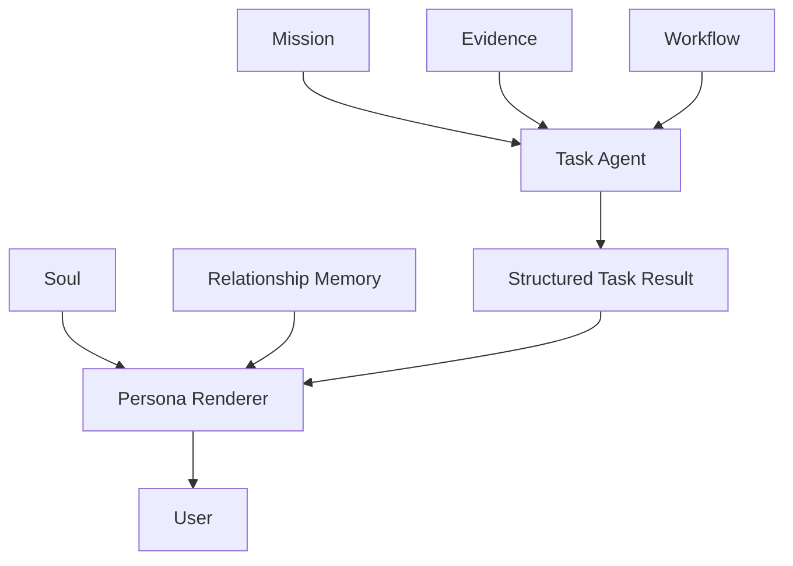

# Agent Persona 与任务结果隔离研究

## 结论

人格不需要提升任务能力，但不能造成任务结果减益。Task Agent 决定任务结果，Soul 只决定最终表达；长期成长感应由真实的 Relationship Memory 提供，而不是让 Soul 自行漂移。

## 架构

## 研究依据

- Principled Personas（EMNLP 2025）：persona 信息可能影响任务性能，不能假定无害。
  https://aclanthology.org/2025.emnlp-main.1364/
- Persona-guided task-oriented dialogue：personalization 与 truthfulness 存在潜在 trade-off。
  https://arxiv.org/abs/2608.18085
- MemoryBank：长期陪伴更依赖持续记忆、相关记忆召回和用户偏好。
  https://ojs.aaai.org/index.php/AAAI/article/view/29946
- Compozy：SOUL.md 作为稳定 identity，而不是运行时能力配置。
  https://github.com/compozy/compozy/blob/main/packages/site/content/docs/agents/soul.mdx

## 本项目边界

Task Agent 负责 Mission、Evidence、Workflow、工具、调查深度、停止条件、Claim、Finding 和任务结论。

Soul 只负责长期身份、称呼、语气、表达节奏、亲近程度、幽默程度和连续感。

Relationship Memory 未来保存用户偏好和共同历史。原则是：**人格稳定，关系成长。**

Persona Renderer 只处理已经完成的用户可见答案，不得新增或改变事实、数字、结论、不确定性和建议。如果渲染失败，回退 Task Agent 原始答案。

## 验收标准

加入人格后，Claim correctness、Evidence grounding、Task completion、Tool selection、Hallucination、uncertainty calibration 均不得下降；同时观察长期表达一致性、用户偏好保持和熟悉感。
