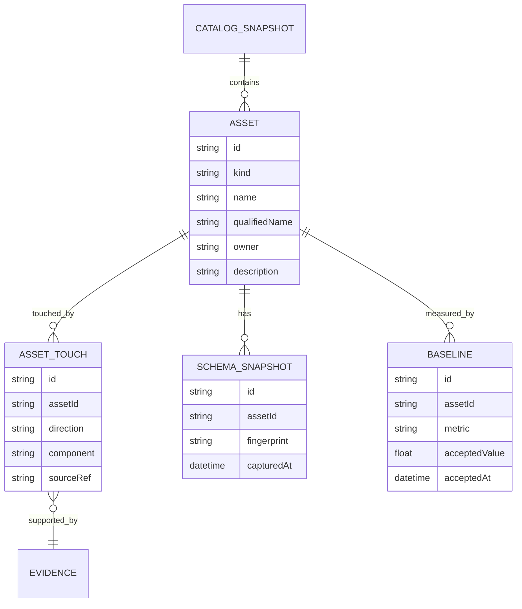
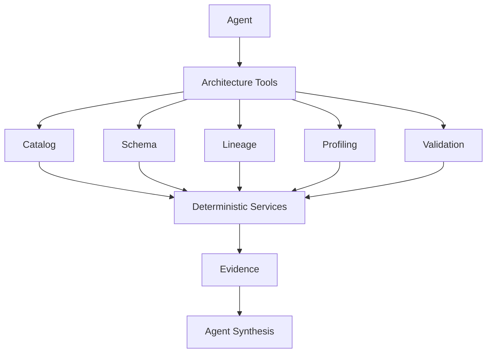
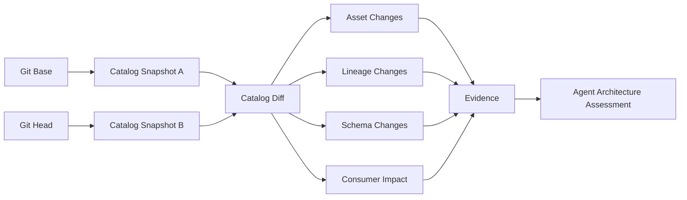
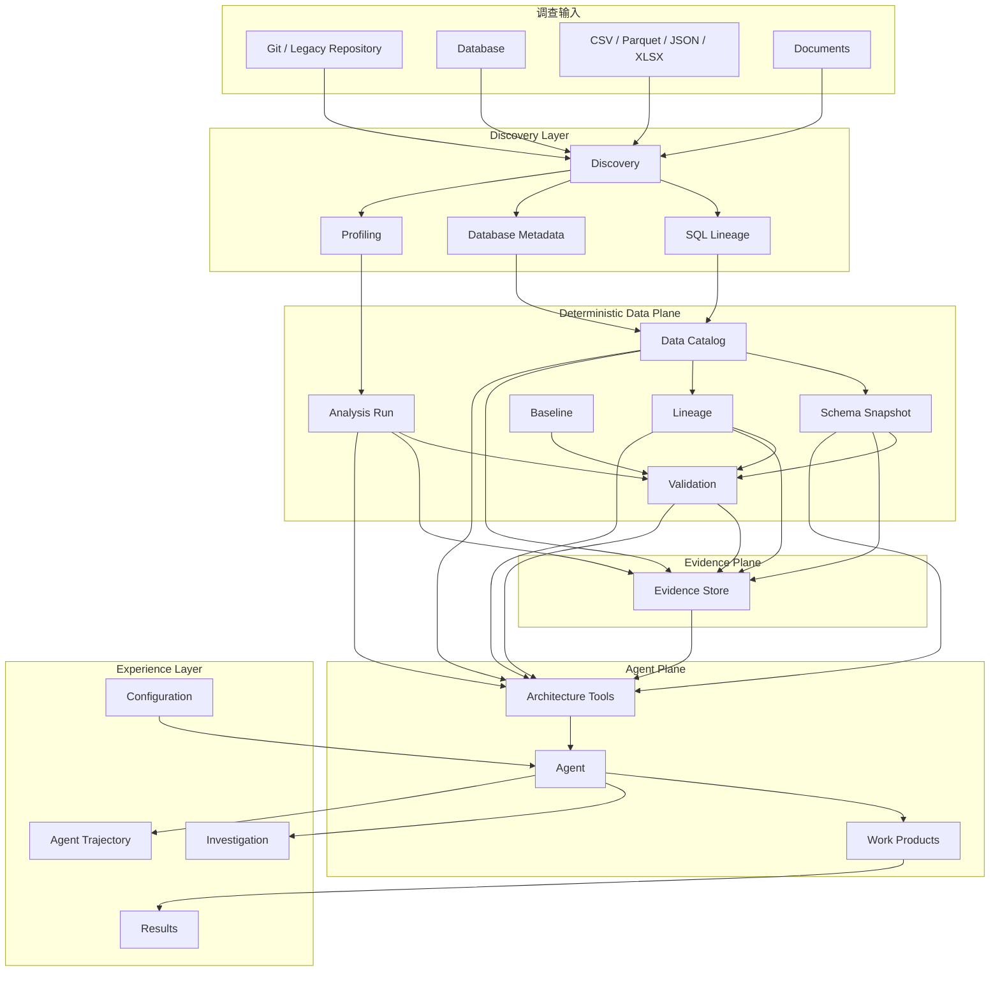
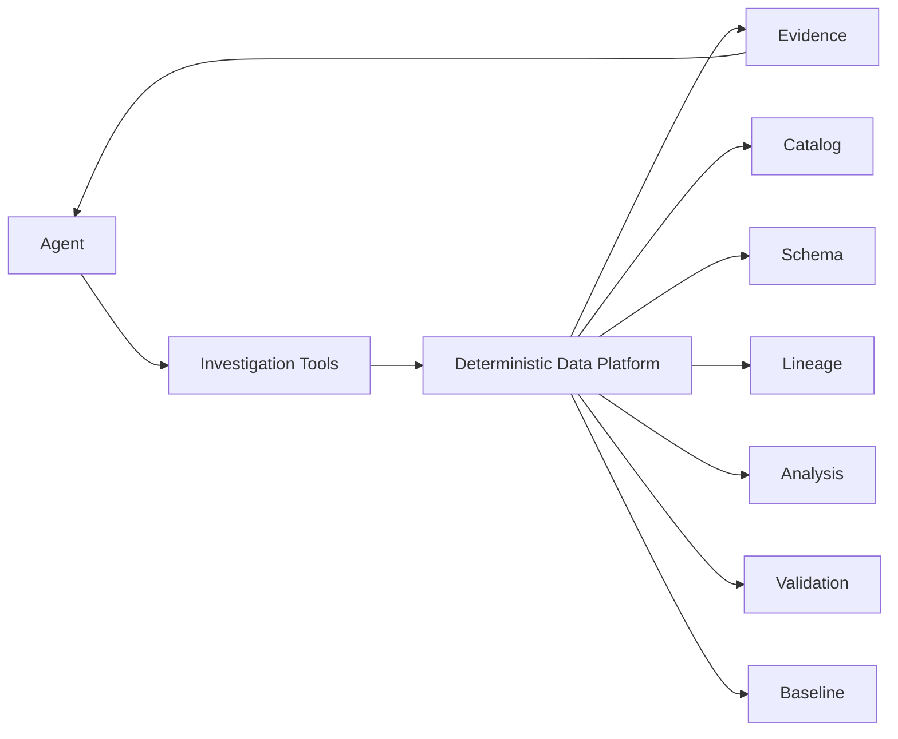

有，而且我认为**值得借鉴的部分相当多，但重点不是“把 DuckDB 再做一遍”**。

我把 [Duckle repository](https://github.com/slothflowlabs/duckle?utm_source=chatgpt.com) 的当前 main 分支、`duckdb-engine`、`metadata`、`catalog`、`runner`、MCP 和前端 Catalog / schema resolver 相关代码都看了一遍，再对照了 [agentic-data-architect repository](https://github.com/saga/agentic-data-architect?utm_source=chatgpt.com) 当前结构。

我的结论是：

> **agentic-data-architect 已经有 Duckle 最核心的一半：Dataset Registry + DuckDB + Evidence + Discovery + Lineage。**
>
> 真正缺的，是把这些东西进一步提升成一个统一的 **Data Catalog / Analysis / Validation 平台内核**，让 Agent 不再主要依赖“自己理解并拼装这些结果”，而是调用一组确定性的架构原语。

Duckle 当前定位本身就是基于 DuckDB 的 ETL/ELT 平台，并且把 lineage、data quality、MCP 等能力放在 DuckDB 之上。([GitHub][1])

---

# 一、先说最重要的判断：不要照搬 Duckle 的“Pipeline Engine”

现在 `agentic-data-architect` 的核心任务是：

```text
Legacy / Existing System
        ↓
Discovery
        ↓
Data Model / Lineage / Profiling
        ↓
Evidence
        ↓
Agent Investigation
        ↓
Architecture / Mapping / Validation
```

而 Duckle 是：

```text
Pipeline
   ↓
Workflow
   ↓
Execution
   ↓
DuckDB
   ↓
Output / Lineage / Quality
```

两者目标不同。

所以我**不建议**把 A-D-A 演化成 Duckle 那种：

```text
workflow-engine
execution-core
duckdb-engine
connector framework
scheduler
runner
385 components
```

这会严重扩大项目。

Duckle 的多 crate 架构是为了一个通用 ETL 产品服务；A-D-A 没有这个需求。Duckle 当前仓库确实已经拆出 workflow、execution、metadata、DuckDB engine、MCP、scheduler 等多个独立 crate。这个分层思想值得借，但实现形式不必复制。([GitHub][1])

---

# 二、真正值得借的是这 7 个设计

## 1. Data Catalog：这是第一优先级

这是我认为 **最值得从 Duckle 借过来的东西**。

Duckle 的 `catalog.rs` 做了一件非常重要的事情：

> 不再只看“一个 pipeline 内部的 lineage”，而是建立 **整个 workspace 的 asset graph**。

它把：

```text
Pipeline
   ↓
Source / Sink
   ↓
Asset
```

抽象出来，然后可以回答：

```text
谁写这个数据？
谁读这个数据？
如果这个数据变了，会影响谁？
哪个数据没人读？
哪个数据没人写？
哪个节点根本没法解析？
```

这和 A-D-A 的任务几乎完全吻合。

你现在的：

```text
DataEstate
LineageGraph
Evidence
DiscoverySnapshot
```

已经有这些数据，但还不是一个真正的 **Catalog API**。

### 我建议增加一个一等公民：

```text
Data Catalog
```

模型可以是：



这里尤其要借 Duckle 一个很好的原则：

**不要因为解析不了就丢掉。**

Duckle 专门有 `unresolved`，因为：

> “少了一块但看起来完整”的 blast radius，比明确告诉用户“不知道”更危险。

这个思路非常适合 Evidence-first 的 A-D-A。

所以应该区分：

```text
unknown
```

和：

```text
unresolved
```

它们不是一回事。

例如：

```text
unknown:
这个字段的业务含义目前不知道

unresolved:
这个 REST source 无法解析出实际 asset
```

前者是语义未知，后者是结构提取失败。

---

# 三、Catalog 不应该只是“查看页面”，而应该成为 Agent 的基础查询层

这是 Duckle 对 A-D-A 最有价值的架构启发。

现在 Agent 很多时候实际上在做这种事情：

```text
搜索代码
→ 找表
→ 找 SQL
→ 找 lineage
→ 自己理解谁依赖谁
→ 再回答用户
```

应该逐渐变成：

```text
Agent
  ↓
catalog_assets
catalog_impact
catalog_consumers
catalog_producers
catalog_orphans
schema_diff
lineage_slice
```

也就是说 Agent 不应该每次都自己重新“算”。

### 建议增加这一层



这和 Duckle 的 MCP 思路也是一致的：MCP 暴露的是 catalog / schema / execution 等能力，而不是让模型自己理解底层实现。Duckle 的 MCP server 直接复用了 DuckDB engine 和组件 catalog。

---

# 四、第二个非常值得借：Schema 是独立的一等对象

Duckle 这里做得很好：

```text
declared schema
        ↓
live schema
        ↓
schema drift
        ↓
breaking / non-breaking
```

而 A-D-A 当前已经有：

```text
Database metadata
ColumnInfo
DataProfile
Lineage
Evidence
Validation
```

但它们还比较分散。

对于你的 modernize / replatform 场景，我建议把：

```text
SchemaSnapshot
```

做成标准对象。

例如：

```text
SchemaSnapshot
├── assetId
├── capturedAt
├── source
├── fingerprint
├── columns[]
├── nullable
├── dataType
├── businessTags
└── evidenceIds[]
```

然后提供：

```text
schema_current
schema_previous
schema_diff
schema_drift
```

---

## Schema Diff 要区分风险

不要只是：

```text
changed = true
```

应该直接 deterministic 分类：

```text
added column
        → compatible

removed column
        → potentially breaking

type widening
        → usually compatible

type narrowing
        → potentially breaking

nullable false → true
        → potentially breaking

cannot inspect
        → unknown
```

这一套与 Duckle `drift.rs` 和 `contracts.rs` 的思路非常接近。

这对 A-D-A 特别重要，因为你的最终问题经常是：

> “旧系统换掉之后，什么会坏？”

而这个问题最终一定会落到：

```text
Schema
+
Lineage
+
Consumer
+
Business rule
```

上。

---

# 五、第三个值得借：Baseline / Observed

这个对你的 **Validation / Reconciliation** 很有价值。

Duckle 的 baseline 模型值得借的不是“性能基线”本身，而是它的生命周期：

```text
Observed
   ↓
Human accepts
   ↓
Baseline
   ↓
Future comparison
```

也就是：

> **Agent 观察到什么 ≠ 系统认可什么。**

A-D-A 很需要这个思想。

例如 migration：

```text
Legacy Position rows = 18,392,111
Target Position rows = 18,392,111
```

这是 observed。

然后：

```text
control total
legacy = 4,821,993,123.42
target = 4,821,993,121.91
difference = -1.51
```

还是 observed。

最后负责人认可：

```text
difference <= 2.00
```

才成为 baseline / acceptance criterion。

所以可以增加：

```text
Baseline
```

支持：

```text
baseline.inspect
baseline.accept
baseline.clear
```

但**绝对不能让 Agent 自动 accept**。

这个和你现在的 Evidence-first、human gate 非常契合。

---

# 六、第四个非常值得借：Run Receipt，而不是只有 Agent Trajectory

这一点很容易被忽略。

现在 A-D-A 已经有：

```text
DiscoveryRun
Agent Turn
Trajectory
LocalAnalysisRun
```

其实已经很接近了。

但它们属于不同历史体系。

Duckle 给我的启发是：

> **一次真正有价值的分析动作应该有一个 durable run identity。**

比如：

```text
AnalysisRun
├── runId
├── type
├── startedAt
├── finishedAt
├── input dataset/version
├── SQL hash
├── engine version
├── status
├── output
├── evidenceIds
└── artifact
```

例如：

```text
run-20261005-0098

operation:
  reconcile

source:
  legacy.position@sha256:abc

target:
  modern.position@sha256:def

key:
  portfolio_id + position_id

measure:
  market_value

result:
  18,392,111 rows
  mismatch = 12
```

这样：

```text
Agent Trajectory
```

回答的是：

> Agent 做了什么

而：

```text
AnalysisRun
```

回答的是：

> 系统真正计算了什么，输入是什么，结果是什么

两者不要混。

---

# 七、第五个值得借：Staleness

这个对你现在的 Discovery 特别有价值。

Duckle 的 Catalog 有一个很好的设计：

```text
Catalog
+
BuiltFrom fingerprint
        ↓
stale?
```

而不是每次打开 catalog 都重新扫描 workspace。

这个设计非常适合 A-D-A。

你现在：

```text
Discovery Snapshot
```

基本属于：

> “最近一次扫描是什么结果？”

但用户真正需要的是：

> “这个结果现在还可信吗？”

所以建议：

```text
DiscoverySnapshot
    ↓
builtFrom
    ├── fileCount
    ├── totalBytes
    ├── newestMtime
    ├── relevantFileHash
    └── datasetFingerprint
```

状态直接变成：

```text
fresh
stale
unknown
```

例如：

```text
数据库 metadata：
fresh

Git repository：
stale

CSV dataset：
changed

schema：
unknown
```

这会大幅提高结果页面的可信度。

---

# 八、第六个值得借：Revision-aware Catalog Diff

这是我认为对你的 **Legacy Modernization** 非常漂亮的一个能力。

Duckle 可以：

```text
build_at_revision(...)
```

也就是直接从 Git object database 读取旧 revision，而不是 checkout 一份。

然后：

```text
Catalog A
vs
Catalog B
```

得到：

```text
asset added
asset removed
producer changed
consumer changed
no longer written
```

A-D-A 可以直接发展成：

```text
investigation compare main...feature
```

最终回答：

> 这次代码修改对数据架构有什么影响？

例如：



这个能力跟 A-D-A 的目标比 Duckle 自己的 ETL pipeline 都更相关。

---

# 九、第七个值得借：把“确定性数据平面”和 Agent 分开

这个其实是 Duckle 整体设计给我的最大启发。

你的系统应该越来越明确地变成：

```text
                 Agent
                   │
             high-level tools
                   │
        ┌──────────┴──────────┐
        │                     │
   Deterministic         Knowledge /
   Data Services          Evidence
        │                     │
   ┌────┼────┐                │
   │    │    │                │
 DuckDB DB  Catalog       Evidence Store
   │    │    │                │
   └────┴────┴───────────────┘
```

也就是说：

**LLM 决定“查什么、为什么查、怎么解释”；代码决定“怎么算”。**

这一点其实已经体现在你现在的：

```text
local_profile
local_reconcile
local_explain
local_query
```

里面。

尤其 `local_reconcile` 已经是一个很好的方向：明确 keys + measures + tolerance，由 DuckDB 做确定性计算，再形成 Evidence。

这应该成为整个系统的主路线，而不是继续增加“让 Agent 自己写 SQL 再自己解释”的比例。

DuckDB 本身就是面向嵌入式/进程内分析的设计，所以这里我反而**不建议复制 Duckle 的 CLI-driven DuckDB engine**。A-D-A 现在的 `@duckdb/node-api` + Node process 对你的本地分析工作台更合适。([DuckDB][2])

---

# 十、因此，我建议 A-D-A 最终形成这个架构



这个结构与现在的代码并不冲突，而是把已有能力重新归位。

---

# 十一、和当前代码的对应关系

| Duckle 思路             | A-D-A 现在                                     | 建议                                     |
| --------------------- | -------------------------------------------- | -------------------------------------- |
| Metadata crate        | `schemas.ts` + `DataEstate`                  | 保留，增加 Catalog domain                   |
| Workspace             | `investigation/workspace.ts`                 | 已经很好                                   |
| Dataset Registry      | `local-data.ts`                              | **保留并增强**                              |
| DuckDB engine         | `local-data.ts`                              | **保留 Node API，不换 CLI**                 |
| Catalog               | DataEstate / lineage 分散                      | **重点增加**                               |
| Schema inference      | DB metadata + local describe                 | **统一 SchemaSnapshot**                  |
| Schema drift          | 零散 validation                                | **增加 deterministic schema_diff/drift** |
| Cross-pipeline impact | 目前不足                                         | **重点增加**                               |
| Unresolved            | unknowns 部分承担                                | **增加结构性 unresolved**                   |
| Run receipt           | DiscoveryRun + LocalAnalysisRun + trajectory | **统一 execution identity**              |
| Checkpoint            | 有                                            | 保留                                     |
| Cache                 | 基本不是核心                                       | **暂不做全套**                              |
| Baseline              | 基本没有                                         | **增加 validation baseline**             |
| Contracts             | modernization 有雏形                            | **增加 schema/business contract check**  |
| Git revision diff     | GitHub research 有                            | **后续增加 catalog diff**                  |
| MCP Catalog           | local-data tools                             | **扩展高层 architecture tools**            |
| Dives                 | 当前没有                                         | 后续可以做 Data Asset Explorer              |
| 385 components        | 不需要                                          | **不要借**                                |
| Scheduler/Runner      | 不属于当前核心                                      | **不要借**                                |
| Rust workspace        | 当前 TS/Node                                   | **不要照搬**                               |

---

# 十二、特别建议：不要再继续把所有东西往 `context.json` 塞

这是我在看两边代码之后比较明确的一个架构建议。

现在 A-D-A 的 `WorkspaceContext` 已经包含：

```text
workflow
discoveryRuns
evidence
claims
findings
inputs
journeyPlan
```

如果继续把：

```text
catalog
schema snapshots
analysis runs
baselines
validation history
```

都塞进去，最终 `context.json` 会变成一个“大而全的 Investigation 状态对象”。

这会开始出现：

```text
mutable state
+
derived state
+
historical state
+
analytical state
```

混在一起。

建议划分：

```text
context.json
    = 当前 Investigation 的控制状态

discovery/
    = immutable Discovery snapshots

catalog/
    = derived Catalog snapshots / index

analysis/
    = deterministic analysis runs / artifacts

reports/
    = human-facing reports

trajectory/
    = Agent execution history

evidence/
    = provenance / evidence
```

这其实和 Duckle 的 workspace 思想很接近：不同生命周期的数据有自己的持久化边界，而不是全部塞进一个状态文件。Duckle 官方架构文档也强调 workspace 是一个可检查、可复制的文件系统边界。([GitHub][3])

---

# 十三、Implementation Plan：我建议分四阶段

## Phase 1：Catalog First

这是最值得马上做的一阶段。

增加：

```text
CatalogAsset
AssetTouch
UnresolvedAsset
CatalogSnapshot
```

然后实现：

```text
catalog.build
catalog.assets
catalog.producers
catalog.consumers
catalog.impact
catalog.orphans
catalog.unresolved
```

同时加入：

```text
builtFrom
fresh / stale
```

**这是第一优先级。**

---

## Phase 2：Schema + Validation

增加：

```text
SchemaSnapshot
schema_current
schema_diff
schema_drift
```

然后把现在的：

```text
local_profile
local_reconcile
```

正式纳入：

```text
Validation Service
```

增加：

```text
Baseline
Observed
Accepted
```

形成：

```text
Observed
   ↓
Compare
   ↓
Finding
   ↓
Human Accept
   ↓
Baseline
```

---

## Phase 3：Analysis Run / Provenance

把目前：

```text
DiscoveryRun
LocalAnalysisRun
AgentTurn
Trajectory
```

的职责明确区分。

不是把它们强行合成一个对象，而是建立统一的：

```text
Run Identity
Run Type
Run Input
Run Output
Run Evidence
```

这样最终结果页面就可以从：

```text
Checkpoint
+
Analysis Runs
+
Evidence
+
Work Products
+
Report
```

组装成真正的 **Investigation Result**。

这也正好和你刚刚让我增加的“调查结果”页面形成基础。

---

## Phase 4：Revision / Impact / Asset Explorer

最后再做：

```text
catalog diff base...head
schema diff
lineage diff
impact analysis
```

然后 UI 增加一个：

**Data Asset Explorer**

点击某个资产，就能看到：

```text
Asset
  ↓
Schema
  ↓
Producer
  ↓
Consumers
  ↓
Lineage
  ↓
Profile
  ↓
Validation
  ↓
Evidence
  ↓
相关 Investigation 结论
```

这个 UI 其实会比单独一个“Data Catalog”更符合 A-D-A。

---

# 十四、哪些 Duckle 设计我明确不建议复制

### 1. 385 个 Component

Duckle 当前已经发展成通用 ETL/ELT 产品，README 目前列出了 385 个组件。([GitHub][1])

A-D-A 完全没有必要。

你需要的是：

```text
data discovery
query
profile
lineage
reconcile
schema
catalog
validation
```

不是：

```text
Salesforce → Kafka → Redis → Email → S3 → ...
```

---

### 2. Rust multi-crate 架构

思想可以借：

```text
execution
metadata
catalog
runtime
```

但不要为了“架构像 Duckle”把 Node/TS 项目拆成很多 package。

现在你的项目规模还不需要。

---

### 3. Duckle runner / scheduler

Duckle 的 Studio / Runner / server 分离是为了 ETL deployment。它明确设计成 studio 和 server runner 共用 workspace format。([GitHub][3])

A-D-A 当前主要还是：

```text
Investigation
```

而不是生产 ETL orchestration。

先不要引入。

---

### 4. DuckDB CLI engine

这里尤其不要照搬。

Duckle 的 `duckdb-engine` 使用 CLI 驱动是它自己的工程 trade-off。

而 DuckDB 本身就是 embedded analytical database；你现在 `@duckdb/node-api` 已经可以直接使用它。([DuckDB][2])

---

# 十五、最终我会把这次借鉴总结成一句架构原则

不是：

> **“把 A-D-A 做成 Duckle。”**

而是：

> **“把 A-D-A 的数据分析能力，从 Agent 可以调用的一组工具，提升为一个由 Catalog、Schema、Lineage、Analysis Run、Validation、Evidence 组成的确定性 Data Investigation Platform；Agent 只负责调查策略和解释。”**

这样以后整个系统会非常清晰：



**我最推荐你下一步先做的不是继续增强 Agent Prompt，而是 Phase 1 的 Catalog。** 因为从你现在的代码状态看，Discovery、DataEstate、Lineage、Dataset Registry、DuckDB、Evidence 都已经存在，缺的正是把它们收敛成一个统一的 **Data Catalog + deterministic query API**。这一步完成后，后面的 schema drift、impact analysis、validation、results page 都会自然很多。

[1]: https://github.com/slothflowlabs/duckle "GitHub - slothflowlabs/duckle: Open-source ETL/ELT you deploy on your own servers or cloud. Built on DuckDB: no-code/low-code visual pipelines or SQL, 385 components, dbt, CDC, data quality, reverse ETL, lineage, MCP for AI agents. No vendor cloud, no per-row billing. · GitHub"
[2]: https://duckdb.org/ "An analytical SQL database management system – DuckDB"
[3]: https://github.com/slothflowlabs/duckle/blob/main/docs/current/client-server-architecture.md "duckle/docs/current/client-server-architecture.md at main · slothflowlabs/duckle · GitHub"
